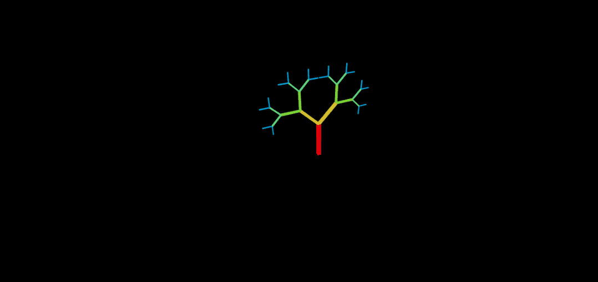

# 🧪 Taller - Construyendo el Mundo: Modelado 3D Algorítmico con React Three Fiber

📅 **Fecha:** 2025-05-17 – Fecha de realización

🎯 **Objetivo del Taller:**
Aprender a construir geometría 3D de manera procedural, es decir, generada desde código, sin necesidad de modelado manual. El foco está en la creación dinámica de estructuras reutilizables y en la manipulación de sus vértices y transformaciones en tiempo real. Usamos React Three Fiber, una abstracción de Three.js para entornos en React.

## 🧠 Conceptos Aprendidos
Lista de conceptos clave aplicados en el taller:

* Modelado procedural
* Geometrías básicas (boxGeometry, sphereGeometry)
* Mapeo de arrays para estructuras repetitivas
* Manipulación directa de vértices con `bufferGeometry.attributes.position.array`
* Uso de `useFrame()` para animaciones dinámicas
* Recursividad para estructuras fractales (árbol)
* Transformaciones espaciales: rotaciones y traslaciones

## 🔧 Herramientas y Entornos
* React + Vite
* Three.js
* React Three Fiber
* @react-three/drei
* VSCode + Live Server o navegador local

## 📁 Estructura del Proyecto
```
2025-05-17_taller_modelado_algoritmico_3d/ 
├── src/ 
│   ├── App.jsx                # Punto de entrada principal 
│   ├── components/
│   │   ├── Grid.jsx           # Cuadrícula de cajas 
│   │   ├── AnimatedSphere.jsx # Esfera con vértices dinámicos 
│   │   ├── FractalTree.jsx    # Árbol fractal recursivo 
│   └── index.css              # Estilos globales 
├── public/
│   └── gifs/                  # Carpeta para colocar los GIFs generados 
├── README.md
```


## 🧪 Implementación

Este taller se centró en la creación de diferentes elementos 3D de forma procedural utilizando React Three Fiber, manipulando geometrías y aplicando animaciones basadas en código.

### 🔹 Etapas realizadas

#### 🌐 React Three Fiber
1.  **Generación de múltiples geometrías:** Se creó una cuadrícula de `boxGeometry` usando arrays mapeados.
2.  **Manipulación directa de vértices:** Con `useFrame()` y `useRef()`, se modificaron los vértices de una `sphereGeometry` en tiempo real para crear efectos de deformación.
3.  **Estructura fractal recursiva:** Se creó un árbol fractal donde cada rama genera nuevas instancias escaladas y rotadas, demostrando el poder de la recursividad en 3D.
4.  **Transformaciones dinámicas:** Se usó `useFrame()` para aplicar animaciones a la esfera y hacer crecer la geometría o rotar sus ramas.

### 🔹 Código relevante

#### 🌐 React Three Fiber (Componentes)

📦 **Creación de una cuadrícula de cajas**
Este fragmento genera múltiples cajas distribuidas en una cuadrícula, usando `Array.from()` y mapeo con coordenadas x y z para posicionarlas dentro de un componente React/R3F.

```jsx
{Array.from({ length: size * size }).map((_, i) => {
  const x = (i % size) * spacing;
  const z = Math.floor(i / zsize) * spacing; // Corregido zsize si es relevante o usar size
  return (
    <mesh key={i} position={[x, 0, z]}>
      <boxGeometry args={[1, 1, 1]} />
      <meshStandardMaterial color='orange' />
    </mesh>
  );
})}

```
🌊 **Deformación en tiempo real de una esfera**

Este bloque de código manipula los vértices y de una sphereGeometry aplicando una oscilación sinusoidal animada con useFrame. Requiere una referencia al objeto malla (mesh.current).
```jsx
useFrame(({ clock }) => {
  const time = clock.getElapsedTime();
  const pos = mesh.current.geometry.attributes.position;
  // Recorrer y modificar vértices
  for (let i = 0; i < pos.count; i++) {
    const y = Math.sin(time + i) * 0.1; // Oscilación
    pos.setY(i, y);
  }
  pos.needsUpdate = true; // Necesario para que Three.js actualice la geometría
});

```

🔄 **Animación continua con useFrame**
Aplicación simple y directa de una animación rotatoria continua a un objeto 3D referenciado por meshRef.current utilizando el hook useFrame de R3F.
```jsx
useFrame(() => {
  if (meshRef.current) {
    meshRef.current.rotation.y += 0.01; // Incrementa la rotación en el eje Y cada frame
  }
});
```


## 📊 Resultados Visuales


Aquí se mostrarán los resultados visuales de las implementaciones realizadas en el taller, en el que se trabajaron las formas, cube grid, fractal tree y way PLane:

🌐 React Three Fiber

## 🎞️ Cube gridGIFT


## 🎞️Fractal tree GIFT



## 🎞️Way PLane GIFT


🧩 Prompts Usados


"Genera una cuadrícula de cajas con React Three Fiber usando map() y posición"

"Crea una esfera 3D cuyos vértices se muevan en tiempo real con useFrame"

"Modela un árbol fractal recursivo usando geometrías básicas y rotación"


💬 Reflexión Final

Este taller me ayudó a entender la diferencia fundamental entre modelar con código y modelar manualmente. Modelar a mano puede ser más visual al inicio, pero tiene limitaciones en términos de repetición y escala. En cambio, modelar proceduralmente te permite crear estructuras complejas y adaptables desde código, con gran reutilización.
Además, manipular los vértices en tiempo real y construir estructuras fractales me permitió ver cómo la matemática y la programación pueden reemplazar herramientas de diseño tradicionales para ciertos tipos de contenido 3D. Sin duda, una forma poderosa de pensar en la geometría como algo vivo y dinámico.