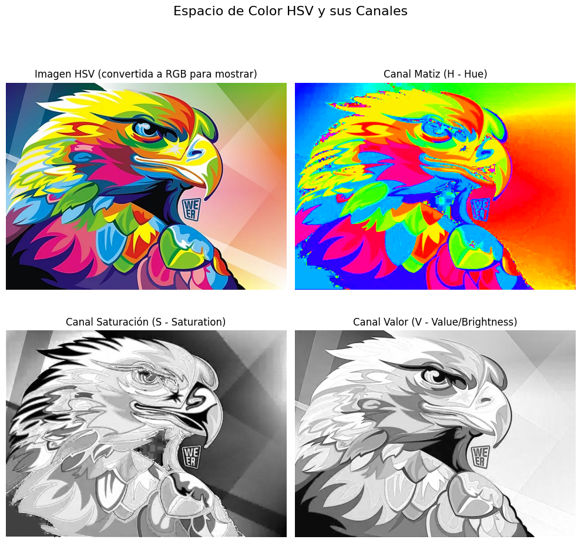
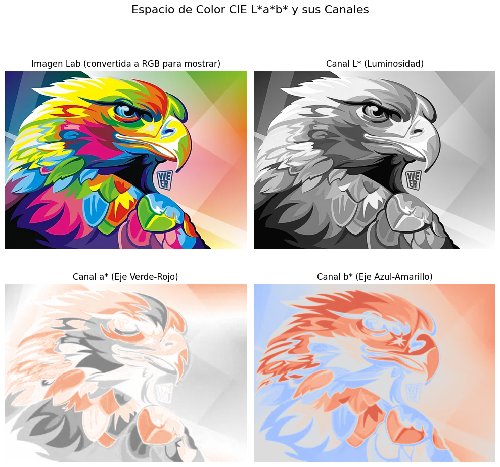
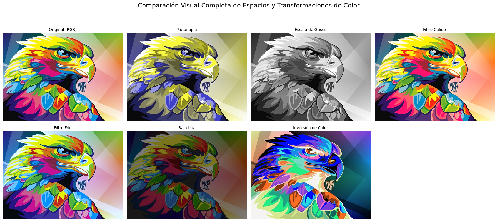

# 🧪 Taller - Explorando el Color: Percepción Humana y Modelos Computacionales

## 📅 Fecha

`2025-05-17` – Fecha de realización

---

## 🎯 Objetivo del Taller

Investigar cómo los seres humanos perciben el color y cómo esta percepción puede ser representada computacionalmente mediante diferentes modelos de color (RGB, HSV, CIE Lab). Además, se aplicaron transformaciones visuales que simulan condiciones especiales como daltonismo o ambientes de baja iluminación para estudiar su impacto perceptual y funcional.

---

## 🧠 Conceptos Aprendidos

Lista de conceptos clave aplicados en el taller:

- Espacios de color: RGB, HSV, CIE Lab
- Separación de canales de color
- Simulación de visión con deficiencia (protanopía)
- Filtros de temperatura (cálido y frío)
- Reducción de contraste y brillo
- Visualización comparativa con `matplotlib`
- Transformaciones de color en NumPy y OpenCV
- Normalización y visualización de canales individuales
- Programación de shaders con GLSL
- Aplicación de materiales y texturas en Three.js
- Uso de interfaces interactivas con Leva UI

---

## 🔧 Herramientas y Entornos

Especifica los entornos usados:

- Python
  - `opencv-python`
  - `numpy`
  - `matplotlib`
- Jupyter Notebook (compatible con Google Colab)
- Three.js / React Three Fiber (visualización 3D)
- Leva UI (interfaz de usuario para parámetros en tiempo real)
- GLSL (Shader Language) (programación de filtros visuales)

---

## 📁 Estructura del Proyecto
```
2025-04-28_taller_construyendo_mundo_3d/
├── python/              # Implentacion python/
├── threejs/             # Implentacion react usando threejs/
│   ├── components/           # SceneCanvas.jsx, ColorControls.jsx
│   └── public/               # Textura por defecto
├── datos/               # Imagen base utilizada
├── resultados/          # Comparaciones y GIFs generados
├── README.md
```
## 🧪 Implementación

Explica el proceso:

### 🔹 Etapas realizadas

#### 🐍 Python
1. Carga de una imagen en formato RGB.
2. Conversión a otros modelos de color: HSV, CIE Lab.
3. Separación y visualización de canales individuales.
4. Simulación de protanopía.
5. Aplicación de filtros: grises, cálido, frío, baja luz, inversión.
6. Visualización comparativa de todos los efectos.

#### 🌐 React.js
1. Creación de escena en React Three.js con geometrías básicas (cubos, esferas).
2. Aplicación de colores dinámicos mediante controles interactivos.
3. Implementación de shaders personalizados para simular:
   - Daltonismo (matriz lineal)
   - Escala de grises (luminancia perceptual)
4. Uso de texturas externas aplicadas a materiales.
5. Integración de Leva UI para seleccionar filtros y texturas.

###  🔹 Código relevante

### 🐍 Python  
Este bloque de código implementa una función dinámica que permite alternar entre diferentes efectos visuales aplicados a una imagen. La función apply_mode recibe una imagen RGB y un parámetro mode que determina el tipo de transformación que se le aplicará. Entre los modos disponibles están:
- original: muestra la imagen sin alteraciones.
- protanopia: simula daltonismo tipo rojo-verde.
- grayscale: convierte la imagen a escala de grises.
- warm: aplica un filtro de temperatura cálida (más tonos rojizos).
- cool: aplica un filtro de temperatura fría (más tonos azulados).
- low_light: simula un entorno con poca luz reduciendo brillo y contraste

```python
#Función dinámica para alternar entre simulaciones
def apply_mode(img, mode):
    if mode == 'original':
        return img / 255.0
    elif mode == 'protanopia':
        return simulate_protanopia(img)
    elif mode == 'grayscale':
        gray = cv2.cvtColor(img, cv2.COLOR_RGB2GRAY)
        return np.stack([gray]*3, axis=-1) / 255.0
    elif mode == 'warm':
        return apply_temperature_filter(img, 'warm')
    elif mode == 'cool':
        return apply_temperature_filter(img, 'cool')
    elif mode == 'low_light':
        return reduce_brightness_contrast(img) / 255.0

# Cambia el modo aquí para probar diferentes efectos
mode = 'grayscale'  # Opciones: original, protanopia, grayscale, warm, cool, low_light

# Mostrar imagen con el modo seleccionado
plt.imshow(apply_mode(img_rgb, mode))
plt.title(f"Modo aplicado: {mode}")
plt.axis('off')
plt.show()
```

### 🌐 React Three Fiber (App.jsx)

Este shader personalizado aplica un filtro visual al plano inferior de la escena. Se basa en un uniform llamado uFilterType, que permite alternar entre distintos tipos de simulaciones:
- 0: Sin filtro (color original).
- 1: Daltonismo simulado (tipo protanopía aproximado mediante mezcla lineal de canales rojo y verde).
- 2: Escala de grises, usando luminancia perceptual mediante una ponderación estándar (0.299 R, 0.587 G, 0.114 B).

```jsx
uniform int uFilterType;
varying vec2 vUv;

vec3 applyFilter(vec3 color) {
  if (uFilterType == 1) {
    return vec3(color.r * 0.566 + color.g * 0.433, color.r * 0.558 + color.g * 0.442, color.b);
  } else if (uFilterType == 2) {
    float gray = dot(color, vec3(0.299, 0.587, 0.114));
    return vec3(gray);
  }
  return color;
}

void main() {
  vec3 baseColor = vec3(vUv, 1.0);  // Color generado desde coordenadas UV
  vec3 filtered = applyFilter(baseColor);
  gl_FragColor = vec4(filtered, 1.0);
}
```

Aquí se define una interfaz gráfica (UI) usando la biblioteca leva, que permite modificar en tiempo real el color de los objetos, aplicar filtros visuales y elegir entre texturas cargadas desde URLs. Esta interacción inmediata es fundamental para explorar visualmente las diferencias entre modelos de color o condiciones de visión simuladas, y fomenta la comprensión práctica de los efectos.
```jsx
const { color, filter, texture } = useControls({
  color: "#00aaff",
  filter: {
    options: {
      Ninguno: 0,
      Daltonismo: 1,
      EscalaGrises: 2
    }
  },
  texture: {
    options: {
      Ninguna: "none",
      UV: "https://threejs.org/examples/textures/uv_grid_opengl.jpg",
      Checker: "https://threejs.org/examples/textures/checker.png",
      Wood: "https://threejs.org/examples/textures/brick_diffuse.jpg"
    }
  }
});
```

## 📊 Resultados Visuales
### 🐍 Python   

#### 🎞️ RGB.
RGB (Rojo, Verde, Azul): Es el modelo estándar para pantallas digitales. Representa los colores mediante la combinación aditiva de estos tres canales. Es intuitivo pero no perceptualmente uniforme, es decir, cambios iguales en valores RGB no siempre se traducen en cambios perceptuales iguales.


#### 🎞️ HSV
HSV (Matiz, Saturación, Valor): Este modelo separa la información del color en componentes más cercanos a la percepción humana: el matiz (tono), la saturación (intensidad del color) y el valor (brillo). Facilita manipular y entender cambios como tono o brillo de forma más natural.


#### 🎞️ L* a* b*
Modelo perceptualmente uniforme que intenta que la distancia entre colores refleje la diferencia visual percibida. L* representa la luminosidad, mientras que a* y b* representan los ejes verde-rojo y azul-amarillo respectivamente. Es muy útil en procesamiento de imagen y corrección de color avanzada.


#### 📊 Comparación de transformaciones


#### 🎞️ Proceso completo en ejecución Python(GIF)


### 🌐 React  

#### 🎞️ Proceso completo en ejecución (GIF)


---

🧩 Prompts Usados


- "Simula daltonismo tipo protanopía con matrices de transformación de color"
- "Aplica un filtro cálido y otro frío a una imagen RGB usando NumPy y OpenCV"
- "Genera una comparación visual entre canales HSV y Lab"
- "¿Cómo puedo modificar un ShaderMaterial en Three.js para simular visión en blanco y negro?"
- "Recomiéndame texturas libres para usar en una escena de Three.js que ayuden a comparar modelos de color"
- "Implementa un selector de textura y color con Leva para React Three Fiber"

---

💬 Reflexión Final  

Este taller nos permitió profundizar en la relación entre percepción visual humana y representaciones digitales de color. Aprendí cómo distintas representaciones (HSV, Lab) separan componentes del color útiles para manipulación visual, segmentación o simulación. Visualizar cada canal ayudó a comprender cómo cada dimensión afecta la percepción global.
Ademas, me permitió profundizar en cómo los modelos de color afectan la percepción visual en contextos gráficos. Fue particularmente interesante trabajar con shaders, ya que ofrecen un gran control sobre cómo se representa el color a nivel de píxel, y permiten simular condiciones visuales como el daltonismo o la visión en escala de grises.

El uso de una interfaz como Leva facilitó la experimentación en tiempo real y la comparación directa de resultados. La parte más interesante fue simular deficiencias visuales y observar cómo una imagen puede perder distinciones críticas. También fue útil aprender cómo ajustar filtros para lograr efectos visuales cálidos o fríos de manera precisa. En futuros proyectos, aplicaría estos conceptos para mejorar la accesibilidad de interfaces visuales o generar transformaciones más perceptuales en procesamiento de imágenes y videojuegos.
