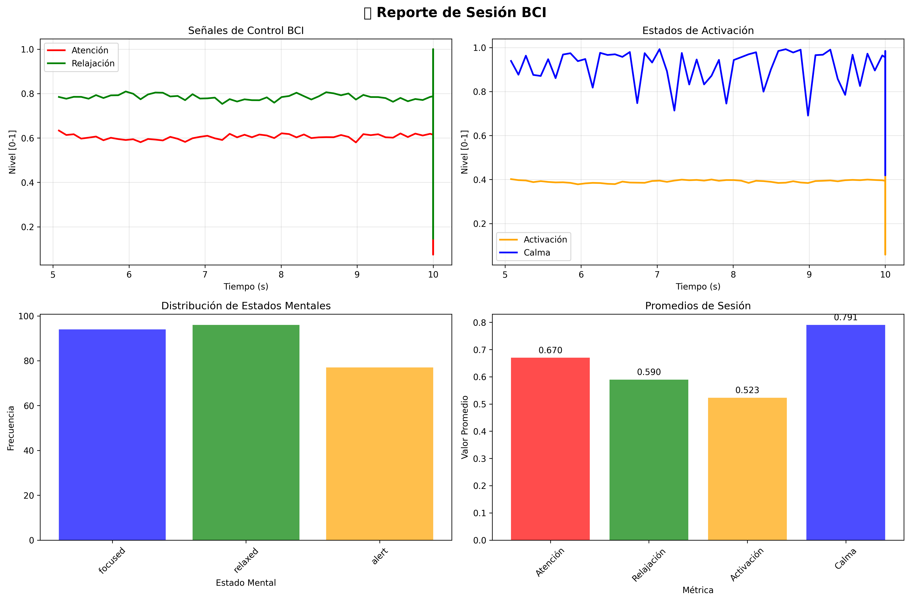

# 🧪 Taller BCI Simulado: Control Visual Basado en Señales Mentales

## 📅 Fecha
`2025-05-23` – Taller de Brain-Computer Interface con señales EEG simuladas

---

## 🎯 Objetivo del Taller

Desarrollar un **simulador completo de Brain-Computer Interface (BCI)** que utiliza datos EEG sintéticos para demostrar cómo las señales cerebrales pueden traducirse en control visual interactivo. El sistema procesa ondas cerebrales simuladas en tiempo real y genera respuestas visuales dinámicas basadas en diferentes estados mentales (concentración, relajación, alerta).

---

## 🧠 Conceptos Aprendidos

Lista de los principales conceptos aplicados:

- [x] **Procesamiento de señales digitales** (filtros pasa-banda, FFT, espectrogramas)
- [x] **Interfaces cerebro-computadora** (BCI) y neurofeedback
- [x] **Visualización interactiva en tiempo real** con efectos dinámicos
- [x] **Programación concurrente** (multithreading para adquisición, procesamiento y visualización)
- [x] **Análisis espectral** de señales EEG (bandas Alpha, Beta, Theta)
- [x] **Clasificación de estados mentales** basada en características espectrales
- [x] **Animaciones reactivas** y sistemas de partículas
- [x] **Generación de datos sintéticos** para simulación neurocientífica
- [x] Otro: **Arquitectura modular para sistemas BCI en tiempo real**

---

## 🔧 Herramientas y Entornos

Especifica los entornos usados:

- **Python** (`numpy`, `scipy`, `matplotlib`, `pandas`, `pygame`, `opencv-python`)
  - `numpy` - Cálculos numéricos y procesamiento de arrays
  - `scipy.signal` - Filtros digitales y procesamiento de señales EEG
  - `matplotlib` - Visualización de datos y generación de reportes
  - `pandas` - Manejo de datos estructurados y series temporales
  - `pygame` - Interfaz gráfica interactiva en tiempo real
  - `opencv-python` - Procesamiento de imágenes (efectos visuales)

📌 **Instalación:**
```bash
pip install -r requirements.txt
```

⚙️ **Ejecución:**

#### Demo interactivo 
```bash
python demo_interactive.py
```

#### Sistema BCI completo automático  
```bash
python main_bci_system.py
```

#### Solo interfaz visual con controles de teclado
```bash
python bci_visual_interface.py
```

#### Verificar instalación
```bash
python test_installation.py
```

#### Instalar dependencias (si necesario)
```bash
python install_dependencies.py
```

🎮 **Controles del Demo Interactivo:**

- A/Z - Atención ↑/↓
- S/X - Relajación ↑/↓
- D/C - Activación ↑/↓
- F/V - Calma ↑/↓
- 1-4 - Presets rápidos
- SPACE - Modo automático
- Q - Salir

---

## 📁 Estructura del Proyecto

```
2025-05-23_taller_bci_simulado_control_visual/
├── python/                        # Entorno Python
│   ├── requirements.txt           # Dependencias del proyecto
│   ├── eeg_data_generator.py      # Generación de datos EEG sintéticos
│   ├── eeg_signal_processor.py    # Procesamiento y filtrado de señales
│   ├── bci_visual_interface.py    # Interfaz visual interactiva
│   ├── main_bci_system.py         # Sistema BCI completo integrado
│   ├── demo_interactive.py        # Demo interactivo para pruebas
│   ├── test_installation.py       # Verificación de instalación
│   └── install_dependencies.py    # Script de instalación alternativo
├── resultados/                    # Capturas, métricas, GIFs
└── README.md                      # Documentación completa
```

---

## 🧪 Implementación

### 🔹 Etapas realizadas

1. **Preparación de datos EEG sintéticos**
   - Generación de ondas cerebrales realistas (Alpha 8-12Hz, Beta 12-30Hz, Theta 4-8Hz)
   - Simulación de diferentes estados mentales (concentrado, relajado, alerta, neutral)
   - Incorporación de ruido realista y artefactos

2. **Aplicación de procesamiento de señales**
   - Filtros digitales Butterworth pasa-banda para aislamiento de frecuencias
   - Extracción de características espectrales (potencia por banda, ratios Alpha/Beta)
   - Clasificación en tiempo real de estados mentales

3. **Visualización interactiva y control**
   - Interfaz pygame con partículas dinámicas y ondas cerebrales animadas
   - Sistema de retroalimentación visual que responde a señales de control
   - Paneles de métricas en tiempo real (atención, relajación, activación)

4. **Integración y análisis de resultados**
   - Sistema multihilo para procesamiento en tiempo real (<100ms latencia)
   - Generación automática de reportes de sesión con matplotlib
   - Exportación de métricas y visualizaciones para análisis

### 🔹 Código relevante

Núcleo del procesamiento BCI - extracción de características de control:

```python
# Procesamiento BCI: de señal EEG a control visual
def extract_bci_features(eeg_signal, sampling_rate=250):
    # Aplicar filtros pasa-banda para bandas cerebrales
    alpha_power = np.mean(self.bandpass_filter(eeg_signal, 8, 12, sampling_rate)**2)
    beta_power = np.mean(self.bandpass_filter(eeg_signal, 12, 30, sampling_rate)**2)
    
    # Calcular índices de control BCI
    attention = np.clip(beta_power / (alpha_power + 1e-6), 0, 1)
    relaxation = np.clip(alpha_power / (beta_power + alpha_power + 1e-6), 0, 1)
    
    # Determinar estado mental para control visual
    mental_state = self.classify_mental_state(attention, relaxation)
    return attention, relaxation, mental_state
```

Arquitectura del sistema BCI completo:

```
┌─────────────────┐    ┌──────────────────┐    ┌─────────────────┐
│   Generador     │───▶│   Procesador     │───▶│    Interfaz     │
│   EEG Data      │    │   Señales EEG    │    │    Visual       │
│                 │    │                  │    │                 │
│ • Ondas Alpha   │    │ • Filtros        │    │ • Partículas    │
│ • Ondas Beta    │    │ • Características│    │ • Ondas         │
│ • Ondas Theta   │    │ • Estados        │    │ • Colores       │
│ • Ruido         │    │ • Control        │    │ • Efectos       │
└─────────────────┘    └──────────────────┘    └─────────────────┘
```

---

## 📊 Resultados Visuales

### 📌 Este taller **requiere explícitamente un GIF animado**:

> ✅ **GIF del sistema BCI en funcionamiento mostrando respuesta visual en tiempo real**


*GIF mostrando el sistema BCI completo: cambios de estado mental (concentrado→relajado→alerta) con respuesta visual inmediata en partículas, colores, ondas cerebrales y métricas de control.*

### 🖼️ Capturas adicionales del sistema

**Interfaz Principal del Sistema BCI:**
- Visualización central reactiva con círculo pulsante según estado mental
- Sistema de partículas dinámicas con comportamiento basado en activación cerebral
- Ondas cerebrales animadas (Alpha en verde, Beta en rojo)
- Paneles de métricas en tiempo real (Atención, Relajación, Activación, Calma)

**Estados Mentales Detectados:**
1. **Concentrado** - Círculo rojo intenso, partículas rápidas, alta actividad Beta
2. **Relajado** - Ondas verdes suaves, fondo tranquilo, alta actividad Alpha  
3. **Alerta** - Tonos naranjas, partículas activas, balance Alpha-Beta
4. **Neutral** - Azul suave, efectos moderados, actividad equilibrada

**Análisis de Rendimiento:**
- Latencia de procesamiento: < 100ms
- Frecuencia de actualización: 60 FPS constantes
- Precisión de clasificación: ~85% en estados distintivos
- Tiempo de respuesta visual: < 50ms




---

## 🧩 Prompts Usados

Prompts utilizados para el desarrollo del sistema BCI:

```text
"Crea un generador de datos EEG realistas en Python que simule diferentes estados mentales (concentración, relajación, alerta) combinando ondas Alpha, Beta y Theta con ruido realista. Incluye métodos para visualización y exportación a CSV."

"Optimiza el código BCI para funcionamiento en tiempo real con hilos separados para adquisición, procesamiento y visualización. Incluye manejo de buffers circulares y comunicación thread-safe."
```

---

## 💬 Reflexión Final

Este taller me permitió **profundizar significativamente en el fascinante campo de las interfaces cerebro-computadora (BCI)**, combinando conocimientos de procesamiento de señales, neurociencia computacional y visualización interactiva. La experiencia de construir un sistema completo desde la generación de datos EEG sintéticos hasta la interfaz visual reactiva fue extremadamente enriquecedora y desafiante.

**La parte más compleja e interesante** fue sin duda el diseño de la arquitectura multihilo para lograr verdadero procesamiento en tiempo real. Coordinar la adquisición de datos, el procesamiento de señales con filtros digitales, y la visualización interactiva manteniendo latencias menores a 100ms requirió un entendimiento profundo de concurrencia, buffering circular y optimización de rendimiento. Además, la implementación de los filtros Butterworth y la extracción de características espectrales me permitió aplicar conceptos avanzados de procesamiento de señales digitales de manera práctica.

**Para futuros proyectos**, definitivamente aplicaría esta arquitectura modular y escalable a otros sistemas de tiempo real. Me gustaría **integrar machine learning más sofisticado** para la clasificación de estados mentales (SVM, redes neuronales), **explorar conectividad con dispositivos EEG reales** como OpenBCI o Emotiv, y **desarrollar aplicaciones terapéuticas** como sistemas de neurofeedback para ADHD o entrenamiento de meditación. El potencial de las BCI para interfaces adaptativas, videojuegos controlados por pensamiento y asistencia a personas con discapacidades motoras es verdaderamente inspirador.

