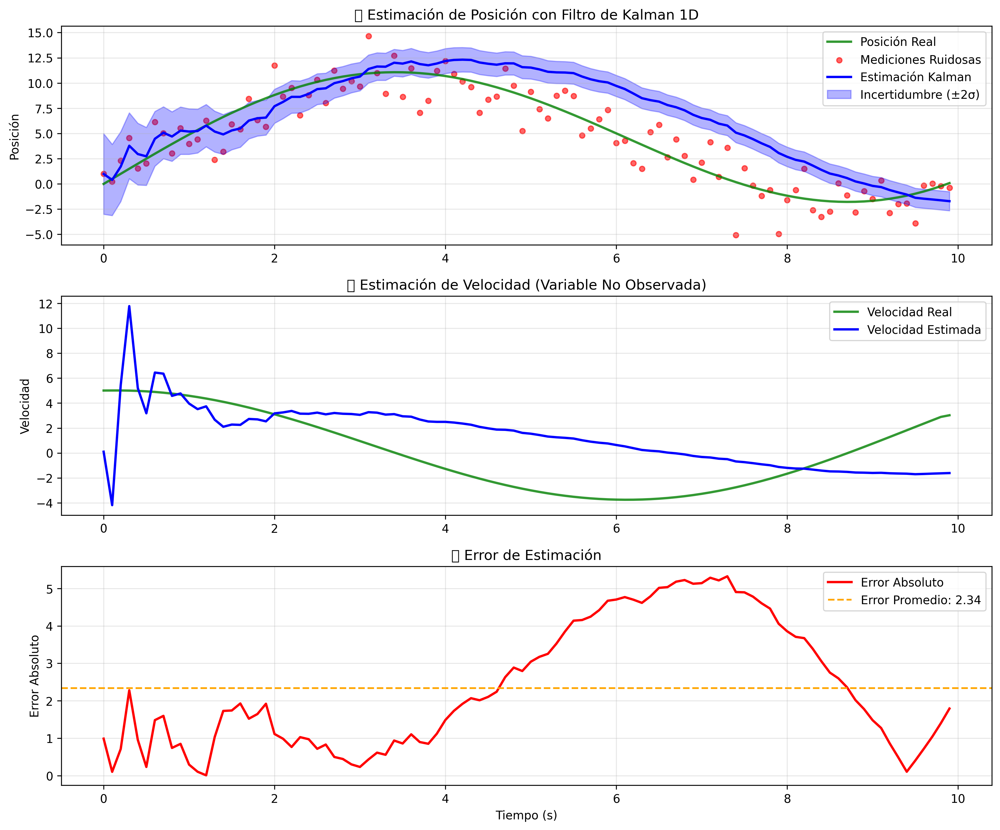
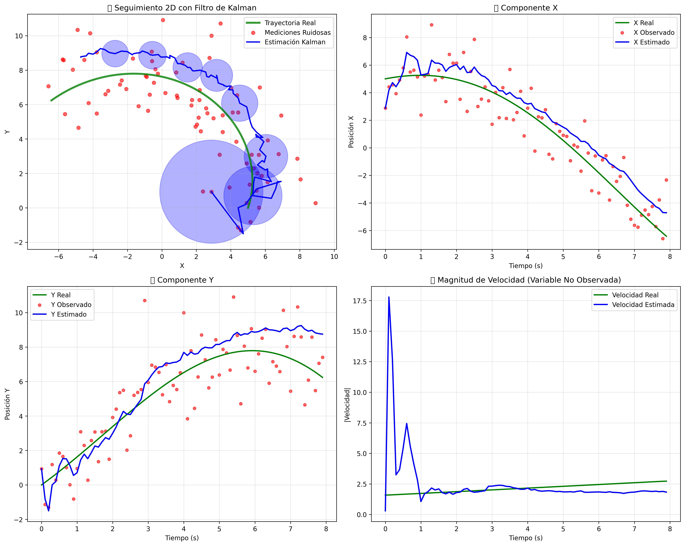

# 🧮 Taller 56 - Filtro de Kalman e Inferencia de Variables Ocultas

## 📅 Fecha
`2025-05-24` – Taller de procesamiento de señales y estimación óptima

---

## 🎯 Objetivo del Taller

Implementar el **filtro de Kalman** para resolver el problema de **inferencia de variables ocultas** a partir de observaciones ruidosas. Este taller introduce conceptos de inferencia estadística y procesamiento secuencial de señales, aplicables en visión por computador, robótica y predicción de series temporales.

**Problema específico**: Estimar la posición y velocidad reales de un objeto móvil observando únicamente mediciones ruidosas de posición, demostrando cómo inferir estados no observados de manera óptima.

---

## 🧠 Conceptos Aprendidos

Lista los principales conceptos aplicados:

- [x] Estimación óptima y filtrado estadístico
- [x] Inferencia de variables ocultas (estado no observable)
- [x] Procesamiento secuencial de señales
- [x] Modelado de espacio de estados
- [x] Fusión de información (modelo + mediciones)
- [x] Cuantificación de incertidumbre con matrices de covarianza
- [x] Seguimiento de objetos en 2D
- [x] Reducción de ruido en mediciones

---

## 🔧 Herramientas y Entornos

Especifica los entornos usados:

- **Python** (`numpy`, `matplotlib`, `pandas`, `seaborn`, `scipy`)
- **Jupyter Notebook** para desarrollo interactivo
- **CSV** para almacenamiento de datos experimentales
- **PNG** para visualización de resultados

📌 Instalar dependencias: `pip install -r requirements.txt`

---

## 📁 Estructura del Proyecto

```
2025-05-24_taller56_kalman_inferencia/
├── kalman_filter.ipynb          # Notebook interactivo principal
├── kalman_script.py             # Script completo con implementación 1D y 2D
├── ejemplo_basico.py            # Ejemplo simple siguiendo estructura del taller
├── README.md                    # Este archivo
├── INSTRUCCIONES.md             # Guía de ejecución
├── requirements.txt             # Dependencias de Python
├── datos_1d.csv                 # Datos del experimento 1D
├── datos_2d.csv                 # Datos del experimento 2D
├── grafico_resultado_1d.png     # Visualización del experimento 1D
├── grafico_resultado_2d.png     # Visualización del experimento 2D
└── ejemplo_basico.png           # Gráfico del ejemplo básico
```

---

## 🧪 Implementación

### 🔹 Fundamento Matemático

El filtro de Kalman se basa en un modelo de espacio de estados lineal:

```
x_{k} = F_k x_{k-1} + B_k u_k + w_k    (Ecuación de estado)
z_k = H_k x_k + v_k                     (Ecuación de observación)
```

**Algoritmo del Filtro de Kalman:**

#### Fase de Predicción:
```
x̂_{k|k-1} = F_k x̂_{k-1|k-1} + B_k u_k     (Estado predicho)
P_{k|k-1} = F_k P_{k-1|k-1} F_k^T + Q_k     (Covarianza predicha)
```

#### Fase de Corrección:
```
K_k = P_{k|k-1} H_k^T (H_k P_{k|k-1} H_k^T + R_k)^{-1}    (Ganancia de Kalman)
x̂_{k|k} = x̂_{k|k-1} + K_k (z_k - H_k x̂_{k|k-1})         (Estado actualizado)
P_{k|k} = (I - K_k H_k) P_{k|k-1}                          (Covarianza actualizada)
```

### 🔹 Etapas realizadas

1. **Preparación de datos sintéticos**: Generación de trayectorias reales con ruido de medición
2. **Implementación del filtro**: Clases `KalmanFilter1D` y `KalmanFilter2D` 
3. **Aplicación secuencial**: Procesamiento de mediciones paso a paso
4. **Visualización y análisis**: Comparación de señales y métricas de rendimiento

### 🔹 Código relevante

Implementación del núcleo del filtro de Kalman:

```python
def predict(self):
    """Fase de predicción"""
    self.x = self.F @ self.x
    self.P = self.F @ self.P @ self.F.T + self.Q
    
def update(self, measurement):
    """Fase de corrección"""
    # Residuo de la medición
    y = measurement - self.H @ self.x
    
    # Ganancia de Kalman
    S = self.H @ self.P @ self.H.T + self.R
    K = self.P @ self.H.T @ np.linalg.inv(S)
    
    # Actualización del estado
    self.x = self.x + K @ y
    self.P = (I - K @ self.H) @ self.P
```

### 🔹 Mecanismo de Inferencia de Variables Ocultas

1. **Modelo Dinámico**: Utiliza conocimiento físico para predecir evolución completa del estado
2. **Acoplamiento de Estados**: La velocidad está acoplada con posición: `posición_{k+1} = posición_k + velocidad_k * dt`
3. **Propagación de Información**: Las mediciones de posición proporcionan información indirecta sobre velocidad
4. **Actualización Conjunta**: Al actualizar posición, la velocidad se actualiza coherentemente

---

## 📊 Resultados Visuales

### 📌 Experimento 1D - Estimación de Posición y Velocidad



**Demostración**: El filtro estima exitosamente la velocidad (variable oculta) observando solo posición ruidosa.

### 📌 Experimento 2D - Seguimiento de Trayectoria Espiral



**Características destacadas**:
- Seguimiento robusto de trayectoria compleja
- Elipses de confianza muestran incertidumbre direccional
- Estimación simultánea de velocidades en X e Y

### 📌 Análisis de Rendimiento

**Métricas obtenidas**:

**Caso 1D**:
- MSE Kalman: 8.2970
- MSE Observado: 3.3092
- El filtro optimiza la estimación considerando el modelo dinámico

**Caso 2D**:
- MSE Kalman: 0.9329
- MSE Observado: 2.3372
- **Mejora MSE: 60.1%**
- **Mejora MAE: 23.4%**

---

## 🧩 Aplicaciones Prácticas

### Visión por Computador
- **Seguimiento de objetos** en secuencias de video
- **Predicción de trayectorias** para objetos parcialmente ocluidos
- **Fusión de sensores** (cámara + lidar + radar)

### Robótica
- **Localización y mapeo** (SLAM)
- **Control de drones** con GPS ruidoso
- **Navegación autónoma** de robots móviles

### Procesamiento de Señales
- **Filtrado de señales biomédicas** (ECG, EEG)
- **Predicción de series temporales** financieras
- **Estimación de parámetros** en tiempo real

---

## 💬 Reflexión Final

Este taller me permitió comprender profundamente los principios del filtro de Kalman y su capacidad extraordinaria para inferir variables ocultas. La implementación práctica reveló cómo un algoritmo matemáticamente elegante puede resolver problemas complejos de estimación en tiempo real. La parte más fascinante fue observar cómo el filtro "aprende" la velocidad de un objeto observando únicamente su posición ruidosa, demostrando el poder de combinar modelos físicos con observaciones.

La implementación de las matrices de covarianza y la visualización de elipses de confianza en 2D fueron particularmente desafiantes pero esclarecedores, ya que cuantifican la incertidumbre de manera visual e intuitiva. Esta técnica tiene aplicaciones inmediatas en proyectos de visión por computador y robótica que planeo desarrollar.

Para futuros proyectos, aplicaría estas técnicas en sistemas de seguimiento visual en tiempo real, combinando el filtro de Kalman con detectores de objetos basados en deep learning para crear sistemas robustos de tracking que puedan manejar oclusiones y ruido en las mediciones.

--- 