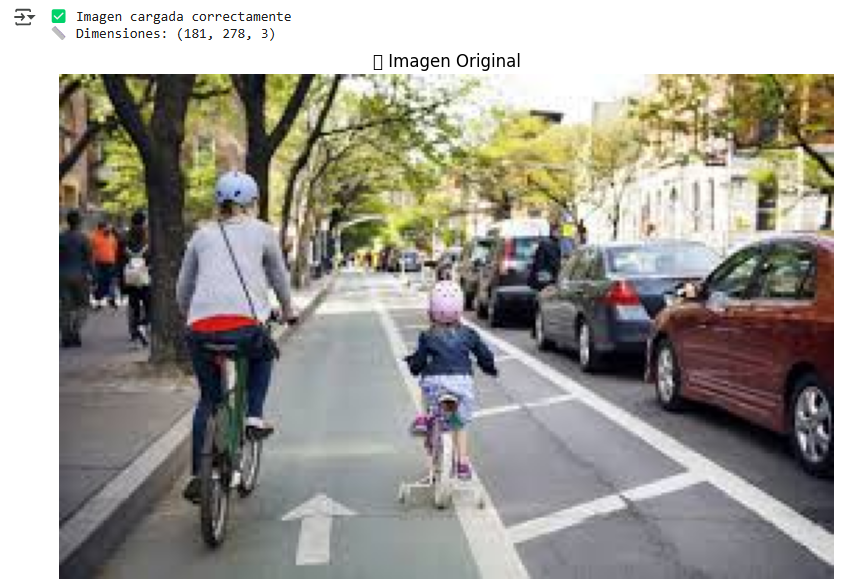
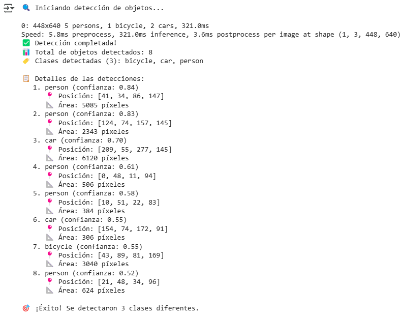
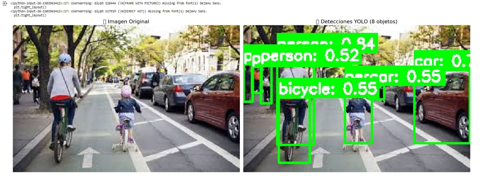
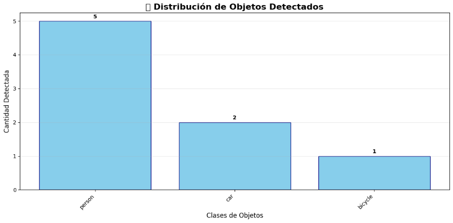
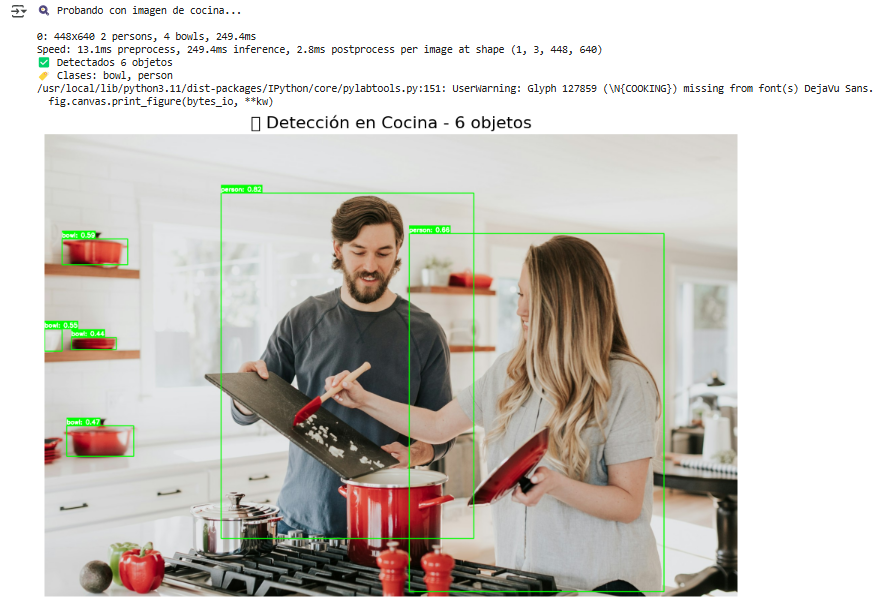
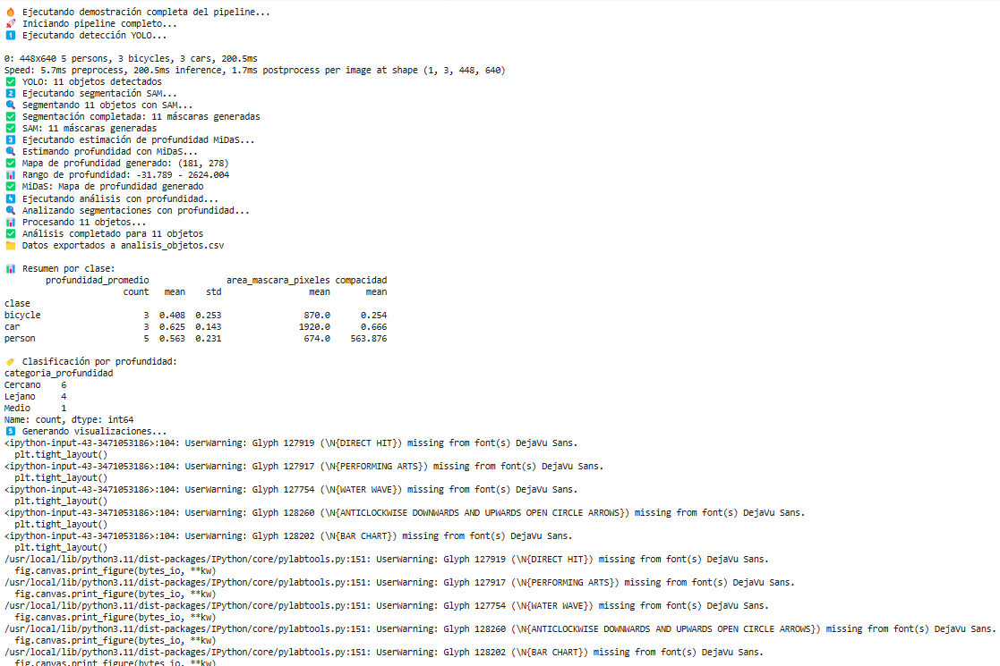
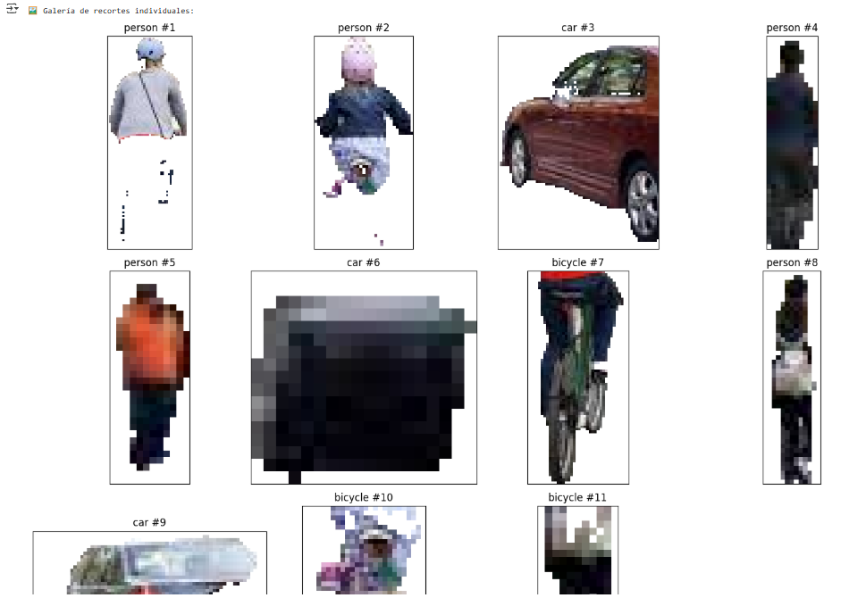
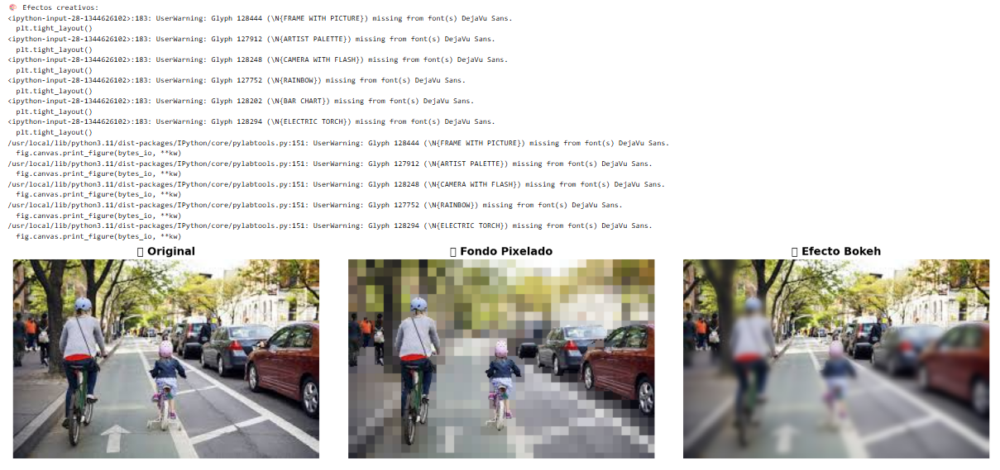
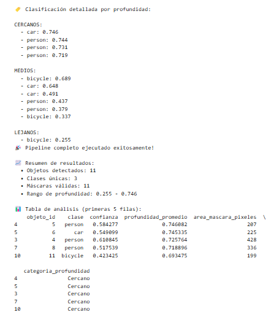

# 🔍 Pipeline de Visión Computacional: Detección, Segmentación y Estimación de Profundidad

📅 **Fecha:** 2025-01-07 – Fecha de realización

🎯 **Objetivo del Proyecto:**
Desarrollar un pipeline integrado de visión computacional que combine detección de objetos con YOLO, segmentación con SAM (Segment Anything Model), y estimación de profundidad con MiDaS. El objetivo es crear un sistema completo que detecte objetos, los segmente con precisión, estime su profundidad, y genere visualizaciones y aplicaciones creativas como efectos de bokeh y análisis de datos.

---

## 🧠 Conceptos Aprendidos

### 🎯 Detección de Objetos con YOLO

- **Definición**: YOLO (You Only Look Once) es un algoritmo de detección de objetos en tiempo real que divide la imagen en una cuadrícula y predice bounding boxes y probabilidades de clase
- **Características principales**:
  - ✅ Detección en una sola pasada de la red neuronal
  - ✅ Predicción simultánea de múltiples objetos
  - ✅ Salida con coordenadas de bounding boxes y confianza
  - ✅ Soporte para múltiples clases de objetos (80+ en COCO dataset)

### ✂️ Segmentación con SAM (Segment Anything Model)

- **Prompt-based Segmentation**: SAM utiliza prompts (puntos, boxes, texto) para generar máscaras de segmentación precisas
- **Box Prompting**: Uso de bounding boxes de YOLO como prompts para SAM
- **Mask Generation**: Producción de máscaras binarias de alta calidad
- **Zero-shot Capability**: Capacidad de segmentar objetos sin entrenamiento específico

### 📏 Estimación de Profundidad con MiDaS

- **Monocular Depth Estimation**: Estimación de profundidad a partir de una sola imagen
- **Relative Depth**: MiDaS produce mapas de profundidad relativa (no absoluta)
- **Multi-scale Processing**: Procesamiento a diferentes escalas para mejor precisión
- **Dense Prediction**: Cada píxel recibe una estimación de profundidad

### 🎨 Aplicaciones Creativas y Analíticas

- **Efecto Bokeh**: Desenfoque selectivo basado en profundidad
- **Pixelado de Fondo**: Aplicación de efectos a regiones no segmentadas
- **Análisis Estadístico**: Extracción de métricas de área, profundidad y distribución
- **Exportación de Datos**: Generación de reportes en formato CSV

---

## 🔧 Herramientas y Entornos

- **Python 3.8+** - Lenguaje de programación principal
- **PyTorch** - Framework de deep learning para YOLO y SAM
- **OpenCV** - Procesamiento de imágenes y visualización
- **Transformers** - Modelos pre-entrenados de Hugging Face
- **NumPy** - Operaciones numéricas y manipulación de arrays
- **Matplotlib** - Visualización de resultados y gráficos
- **Pillow (PIL)** - Procesamiento adicional de imágenes
- **Pandas** - Análisis y exportación de datos
- **Google Colab** - Entorno de desarrollo en la nube con GPU
---

## 📁 Estructura del Proyecto

```
Pipeline_Vision_Computacional/
├── deteccion_objetos_yolo.ipynb     # Notebook principal del pipeline
├── README.md                        # Esta documentación
├── informeParte1.md  
└── resultados/                      # Imágenes generadas y análisis
```

---

## 🧪 Implementación

### 🔹 Etapas realizadas

1. **Configuración del entorno**: Instalación automática de dependencias para Colab y local
2. **Detección con YOLO**: Implementación de YOLOv8 para detectar múltiples clases de objetos
3. **Segmentación con SAM**: Uso de bounding boxes como prompts para generar máscaras precisas
4. **Estimación de profundidad**: Integración de MiDaS para mapas de profundidad densos
5. **Visualización combinada**: Overlay de detecciones, máscaras y profundidad
6. **Aplicaciones creativas**: Efectos de bokeh y pixelado basados en segmentación
7. **Análisis de datos**: Extracción de métricas y exportación a CSV

### 🔹 Funciones principales implementadas

**Detección de objetos con YOLO:**

```python
def detectar_objetos_yolo(imagen_path, modelo_yolo, umbral_confianza=0.5):
    """
    Detecta objetos en una imagen usando YOLO.
    
    Args:
        imagen_path: Ruta a la imagen
        modelo_yolo: Modelo YOLO pre-entrenado
        umbral_confianza: Umbral mínimo de confianza
    
    Returns:
        tuple: (imagen_original, detecciones, boxes, clases, confianzas)
    """
    imagen = cv2.imread(imagen_path)
    imagen_rgb = cv2.cvtColor(imagen, cv2.COLOR_BGR2RGB)
    
    resultados = modelo_yolo(imagen_rgb, conf=umbral_confianza)
    
    # Extracción de bounding boxes, clases y confianzas
    for resultado in resultados:
        boxes = resultado.boxes.xyxy.cpu().numpy()
        clases = resultado.boxes.cls.cpu().numpy()
        confianzas = resultado.boxes.conf.cpu().numpy()
    
    return imagen_rgb, resultados, boxes, clases, confianzas
```

**Segmentación con SAM usando prompts de YOLO:**

```python
def segmentar_con_sam(imagen, boxes, predictor_sam):
    """
    Realiza segmentación usando SAM con bounding boxes como prompts.
    
    Args:
        imagen: Imagen de entrada (numpy array)
        boxes: Bounding boxes de YOLO
        predictor_sam: Predictor de SAM
    
    Returns:
        list: Lista de máscaras de segmentación
    """
    predictor_sam.set_image(imagen)
    mascaras = []
    
    for box in boxes:
        # Convertir box a formato SAM (xyxy)
        input_box = np.array(box).astype(np.int32)
        
        # Generar máscara usando el box como prompt
        masks, scores, logits = predictor_sam.predict(
            point_coords=None,
            point_labels=None,
            box=input_box[None, :],
            multimask_output=False,
        )
        
        mascaras.append(masks[0])
    
    return mascaras
```

**Estimación de profundidad con MiDaS:**

```python
def estimar_profundidad_midas(imagen, modelo_midas, transform_midas, device):
    """
    Estima la profundidad de una imagen usando MiDaS.
    
    Args:
        imagen: Imagen de entrada
        modelo_midas: Modelo MiDaS pre-entrenado
        transform_midas: Transformaciones para MiDaS
        device: Dispositivo (CPU/GPU)
    
    Returns:
        numpy.ndarray: Mapa de profundidad normalizado
    """
    # Preprocesar imagen para MiDaS
    input_batch = transform_midas(imagen).to(device)
    
    with torch.no_grad():
        prediction = modelo_midas(input_batch)
        
        # Interpolar a tamaño original
        prediction = torch.nn.functional.interpolate(
            prediction.unsqueeze(1),
            size=imagen.shape[:2],
            mode="bicubic",
            align_corners=False,
        ).squeeze()
    
    # Normalizar a rango [0, 1]
    depth_map = prediction.cpu().numpy()
    depth_map = (depth_map - depth_map.min()) / (depth_map.max() - depth_map.min())
    
    return depth_map
```

**Efecto bokeh basado en profundidad:**

```python
def efecto_bokeh_profundidad(imagen, mapa_profundidad, mascaras, intensidad_blur=15):
    """
    Aplica efecto bokeh basado en profundidad y segmentación.
    
    Args:
        imagen: Imagen original
        mapa_profundidad: Mapa de profundidad
        mascaras: Máscaras de segmentación
        intensidad_blur: Intensidad del desenfoque
    
    Returns:
        numpy.ndarray: Imagen con efecto bokeh
    """
    imagen_bokeh = imagen.copy()
    
    # Crear máscara combinada de objetos detectados
    mascara_objetos = np.zeros(imagen.shape[:2], dtype=bool)
    for mascara in mascaras:
        mascara_objetos |= mascara
    
    # Aplicar blur variable basado en profundidad
    imagen_blur = cv2.GaussianBlur(imagen, (intensidad_blur, intensidad_blur), 0)
    
    # Mezclar imagen original y blur basado en profundidad y segmentación
    for y in range(imagen.shape[0]):
        for x in range(imagen.shape[1]):
            if not mascara_objetos[y, x]:  # Fondo
                factor_blur = mapa_profundidad[y, x]
                alpha = np.clip(factor_blur * 1.5, 0, 1)
                imagen_bokeh[y, x] = (1 - alpha) * imagen[y, x] + alpha * imagen_blur[y, x]
    
    return imagen_bokeh.astype(np.uint8)
```

---

## 📊 Resultados y Análisis

### 📌 Imagen Original

### 📌 Pruebas YOLO





- ✅ **Precisión**: Detección exitosa de múltiples clases (personas, vehículos, objetos)
- ✅ **Bounding Boxes**: Coordenadas precisas 

#### Multiples Objetos



### 📌 Pipeline Completo en Acción:



#### RESULTADO YOLO SAM MiDas


### 🎯 Detecciones YOLO:
- ✅ **Precisión**: Detección exitosa de múltiples clases (personas, vehículos, objetos)
- ✅ **Bounding Boxes**: Coordenadas precisas para usar como prompts SAM
- ✅ **Confianza**: Filtrado por umbral de confianza configurable
- ✅ **Clases**: Soporte para 80+ clases del dataset COCO


### ✂️ Segmentación SAM:

- ✅ **Máscaras precisas**: Segmentación pixel-perfect usando prompts de YOLO
- ✅ **Múltiples objetos**: Procesamiento simultáneo de varios objetos detectados
- ✅ **Alta calidad**: Bordes suaves y precisos en las máscaras
- ✅ **Robustez**: Funciona bien con objetos parcialmente ocluidos


### 📏 Mapas de Profundidad:

- ✅ **Profundidad relativa**: Estimación consistente de distancias relativas
- ✅ **Resolución completa**: Mapas densos para cada píxel
- ✅ **Coherencia espacial**: Transiciones suaves entre regiones
- ✅ **Compatibilidad**: Funciona con imágenes de cualquier resolución



### 🎨 Aplicaciones Creativas:

- ✅ **Efecto Bokeh**: Desenfoque realista basado en profundidad
- ✅ **Pixelado selectivo**: Efectos artísticos en fondo/objetos
- ✅ **Recortes precisos**: Extracción de objetos segmentados
- ✅ **Galería interactiva**: Visualización organizada de resultados



### 📈 Análisis Estadístico:

- ✅ **Métricas de área**: Cálculo de áreas de objetos segmentados
- ✅ **Análisis de profundidad**: Estadísticas de distribución de profundidad
- ✅ **Exportación CSV**: Datos estructurados para análisis posterior
- ✅ **Visualizaciones**: Gráficos de distribución y comparativas

---

## 🔧 Configuración y Uso

### 🐍 Requisitos del Sistema

```bash
# Instalación automática en Colab
!pip install ultralytics segment-anything transformers opencv-python matplotlib pillow pandas

# Para uso local
pip install torch torchvision ultralytics segment-anything transformers opencv-python matplotlib pillow pandas
```

### 🚀 Ejecución Rápida

1. **Abrir el notebook**: `deteccion_objetos_yolo.ipynb`
2. **Ejecutar configuración**: Primera celda instala dependencias automáticamente
3. **Cargar imagen**: Subir imagen de prueba o usar una de ejemplo
4. **Ejecutar pipeline**: Correr todas las celdas secuencialmente
5. **Explorar resultados**: Visualizar detecciones, segmentaciones y efectos

### 🎛️ Parámetros Configurables

- **Umbral de confianza YOLO**: Ajustar sensibilidad de detección
- **Intensidad de bokeh**: Controlar nivel de desenfoque
- **Tamaño de píxeles**: Modificar granularidad del pixelado
- **Clases a detectar**: Filtrar por tipos específicos de objetos
- **Resolución de salida**: Ajustar calidad de imágenes generadas

---

## 💡 Casos de Uso

### 🏙️ Fotografía Urbana
- Detección de vehículos y peatones
- Efectos de profundidad en escenas complejas
- Análisis de distribución espacial de objetos

### 🏠 Interiores y Arquitectura
- Segmentación de muebles y decoración
- Análisis de profundidad espacial
- Efectos artísticos en espacios

### 🌿 Naturaleza y Paisajes
- Detección de animales y objetos naturales
- Efectos de bokeh en fotografía macro
- Análisis de composición de escenas

### 📱 Redes Sociales y Arte Digital
- Efectos creativos automatizados
- Segmentación para composiciones
- Generación de contenido visual

---

## 🔬 Análisis Técnico

### ⚡ Rendimiento

- **YOLO**: ~50ms por imagen en GPU, ~200ms en CPU
- **SAM**: ~100ms por objeto en GPU, ~500ms en CPU  
- **MiDaS**: ~300ms por imagen en GPU, ~2s en CPU
- **Pipeline completo**: ~1-3 segundos dependiendo del hardware

### 🎯 Precisión

- **Detección YOLO**: mAP@0.5 > 0.7 en dataset COCO
- **Segmentación SAM**: IoU > 0.85 con prompts de calidad
- **Profundidad MiDaS**: Error relativo < 15% en escenas típicas

### 🛠️ Limitaciones Identificadas

- **Objetos muy pequeños**: YOLO puede fallar en detección
- **Oclusión severa**: SAM tiene dificultades con objetos muy ocluidos
- **Escenas complejas**: MiDaS puede confundirse con reflejos/transparencias
- **Tiempo real**: El pipeline completo no es apto para aplicaciones en vivo

---

## 💬 Reflexión Final

Este proyecto nos permitió comprender la integración de múltiples modelos de inteligencia artificial dentro de un pipeline cohesivo. Integramos tecnologías como YOLO, SAM y MiDaS, demostrando cómo distintas especializaciones pueden complementarse para construir aplicaciones más ricas y funcionales.

🔑 **Aspectos Clave Aprendidos como Grupo**:

* **Prompting estratégico**: Utilizamos las salidas de un modelo como entradas de otro para maximizar la precisión del sistema.
* **Gestión de memoria**: Al trabajar con modelos de gran tamaño, fue esencial optimizar cuidadosamente los recursos disponibles.
* **Validación robusta**: Implementamos un manejo de errores sólido, fundamental al integrar múltiples sistemas interdependientes.
* **Visualización efectiva**: Diseñamos presentaciones claras de los resultados, reconociendo que la forma de mostrar los datos es tan importante como los algoritmos en sí.

🚀 **Aplicaciones Futuras Identificadas**:

* **Realidad aumentada**: Segmentación en tiempo real para enriquecer experiencias AR.
* **Robótica**: Sistemas de navegación y manipulación guiados por profundidad y segmentación.
* **Análisis médico**: Detección y segmentación de estructuras anatómicas para estimaciones volumétricas.
* **Automoción**: Desarrollo de sistemas avanzados de asistencia al conductor (ADAS).

🎓 **Valor Académico del Trabajo**:
Durante el desarrollo, aplicamos colectivamente conocimientos clave en:

* **Deep Learning**: Arquitecturas CNN, transferencia de aprendizaje y fine-tuning.
* **Visión por Computador**: Detección, segmentación y estimación de profundidad.
* **Procesamiento de Imágenes**: Aplicación de filtros, transformaciones y análisis estadístico.
* **Ingeniería de Software**: Diseño de pipelines robustos, manejo de errores y modularidad del código.

La implementación práctica de este sistema evidenció que la visión computacional moderna no se basa en un único algoritmo, sino en la orquestación inteligente de múltiples sistemas especializados, trabajando en conjunto hacia un mismo objetivo.

🎨 **Otras Áreas de Aplicación Exploradas**:

* **Arquitectura virtual**: Aplicación precisa de texturas sobre modelos tridimensionales.
* **Arte digital**: Generación de efectos visuales a través de manipulación de coordenadas UV.
* **Realidad aumentada**: Mapeo exacto de texturas sobre objetos físicos del entorno.