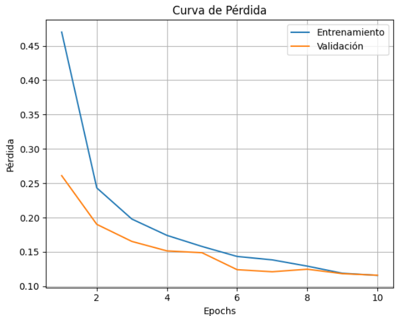
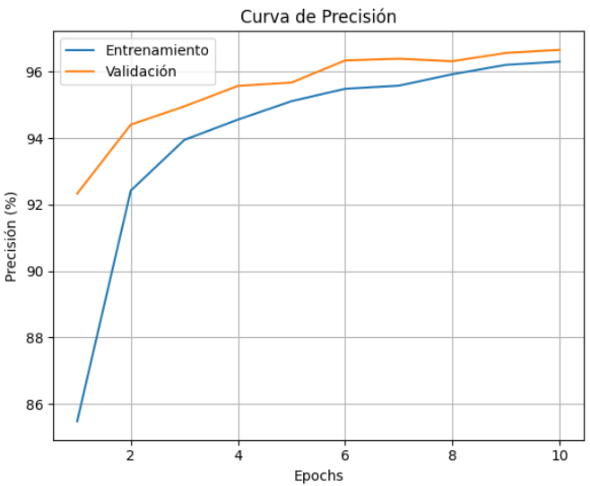
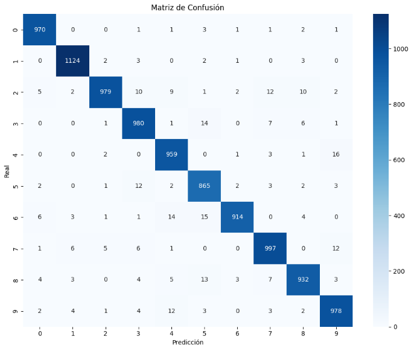
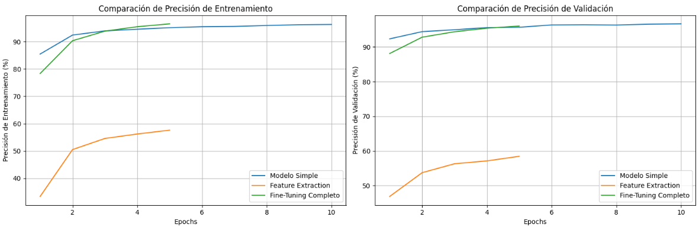
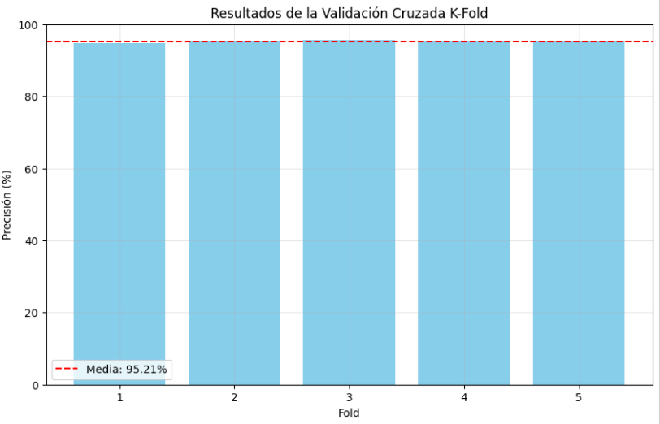

# 🎯 Taller de Entrenamiento de un Modelo de Deep Learning de Inicio a Fin

📅 **Fecha:** 2025-06-22 – Fecha de realización

🎯 **Objetivo del Taller:**
Guiar paso a paso el entrenamiento completo de un modelo de Deep Learning, desde la preparación de datos hasta la evaluación, validación cruzada, fine-tuning y exportación. El objetivo es que el estudiante comprenda el flujo completo y pueda aplicar estos principios a sus propios proyectos.

## 🧠 Conceptos Aprendidos

Lista de conceptos clave aplicados en el taller:

* **Preparación de datos**: Carga y visualización del dataset MNIST.
* **Entrenamiento de modelos**: Implementación de una red neuronal simple.
* **Validación cruzada**: Uso de K-Fold Cross Validation para evaluar robustez.
* **Fine-Tuning**: Adaptación de un modelo preentrenado (ResNet18).
* **Exportación de modelos**: Guardado y reutilización de modelos entrenados.

## 🔧 Herramientas y Entornos

* Python + PyTorch
* NumPy
* Matplotlib
* Seaborn
* Scikit-learn
* tqdm

## 📁 Estructura del Proyecto

```
2025-06-22_taller_entrenamiento_modelo_deep_learning_completo/
├── python/
│   └── entrenamiento_modelo.ipynb
├── modelos/
│   └── modelo_simple.pth
│   └── modelo_fine_tuned.pth
├── resultados/
│   ├── curva_loss.png
│   ├── confusion_matrix.png
│   ├── comparacion_precisiones.png
│   ├── kfold_results.png
│   └── comparacion_metrics.csv
├── README.md
```

## 🧪 Implementación

La implementación de este taller se centra en el entrenamiento de un modelo de Deep Learning utilizando el dataset MNIST. Se desarrollaron scripts en Python que permiten realizar las siguientes tareas:

- **Carga y visualización de datos**: Descarga y preprocesamiento del dataset MNIST.
- **Entrenamiento de modelos**: Implementación de una red neuronal simple.
- **Validación cruzada**: Evaluación del modelo con K-Fold Cross Validation.
- **Fine-Tuning**: Uso de ResNet18 preentrenado para mejorar el rendimiento.
- **Exportación de modelos**: Guardado de modelos entrenados para uso futuro.

### 🔹 Etapas realizadas

1. **Carga y visualización de datos**: Descarga del dataset MNIST y visualización de ejemplos.
2. **Preparación de dataloaders**: División de datos en conjuntos de entrenamiento, validación y prueba.
3. **Entrenamiento de modelos**: Implementación de una red neuronal simple.
4. **Validación cruzada**: Evaluación del modelo con K-Fold Cross Validation.
5. **Fine-Tuning**: Adaptación de ResNet18 preentrenado.
6. **Exportación de modelos**: Guardado de modelos entrenados.

### 🔹 Código relevante

📌 **1. Entrenamiento de modelos**

```python
train_losses, val_losses, train_accs, val_accs = train_model(
    model, train_loader, val_loader, criterion, optimizer, epochs, device
)
```

📌 **2. Validación cruzada**

```python
fold_results, mean_accuracy, std_accuracy = kfold_cross_validation(
    train_data, k=5, batch_size=64, epochs=3, device=device
)
```

📌 **3. Fine-Tuning**

```python
model_ft = models.resnet18(pretrained=True)
model_ft.fc = nn.Linear(num_ftrs, 10)
train_losses_ft, val_losses_ft, train_accs_ft, val_accs_ft = train_model(
    model_ft, train_loader, val_loader, criterion_ft, optimizer_ft, epochs_ft, device
)
```

## 📊 Resultados y Análisis

### 📌 Curvas de Entrenamiento y Validación






### 📌 Matriz de Confusión


### 📌 Comparación de Modelos


### 📌 Resultados de K-Fold Cross Validation


### 📌 Comparación de Métricas

Los resultados comparativos entre los diferentes enfoques están disponibles en el archivo `resultados/comparacion_metrics.csv`.

## 💬 Reflexión Final

Este taller me permitió comprender el flujo completo de entrenamiento de un modelo de Deep Learning, desde la preparación de datos hasta la evaluación y fine-tuning. Aprendí que:

1. **Fine-Tuning** mejora significativamente el rendimiento del modelo, especialmente en tareas donde los datos son limitados.
2. **Validación cruzada** proporciona una evaluación más robusta del modelo, ayudando a detectar problemas como el sobreajuste.

La transferencia de aprendizaje es una técnica poderosa que permite aprovechar modelos preentrenados para mejorar el rendimiento en tareas específicas, incluso con datasets pequeños.
