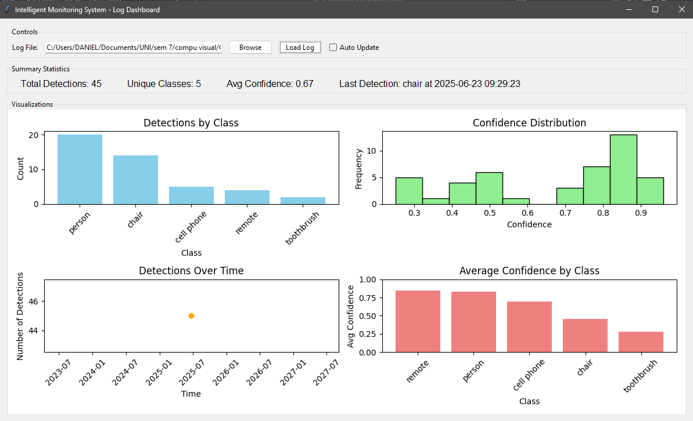
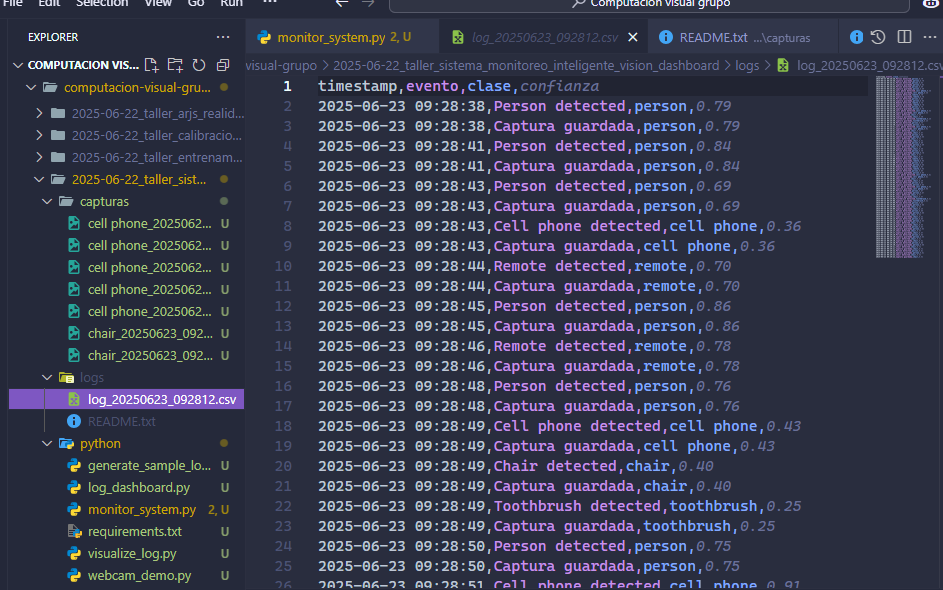

# 🎯 Sistema de Monitoreo Inteligente con Visión por Computador

📅 **Fecha:** 2025-06-22

## 🔍 Objetivo del Proyecto

Este proyecto implementa un sistema de monitoreo inteligente basado en visión por computador, capaz de detectar personas y objetos en tiempo real, visualizar estadísticas en un panel interactivo, y registrar eventos relevantes con capturas automáticas.

## 🧠 Conceptos Aplicados

* **Detección de objetos en tiempo real**: Usando YOLOv8 o cvlib para identificar personas y objetos.
* **Interfaz gráfica interactiva**: Creada con Tkinter y Matplotlib para visualizar la transmisión y estadísticas.
* **Registro automático de eventos**: Sistema de logs que documenta detecciones y guarda capturas.
* **Procesamiento multihilo**: Separación de la captura/procesamiento y la interfaz de usuario.
* **Análisis de datos en tiempo real**: Visualización de conteos y tendencias de detección.

## 🔧 Herramientas y Entorno

* **Python 3.8+**
* **Frameworks y bibliotecas**:
  * OpenCV - Captura y procesamiento de video
  * YOLOv8 (ultralytics) / cvlib - Detección de objetos
  * Tkinter - Interfaz gráfica
  * Matplotlib - Visualización de estadísticas
  * Pandas - Manejo de datos y logs

## 📁 Estructura del Proyecto

```
2025-06-22_taller_sistema_monitoreo_inteligente_vision_dashboard/
├── python/
│   ├── monitor_system.py - Script principal del sistema
│   └── requirements.txt - Dependencias del proyecto
├── capturas/ - Imágenes capturadas al detectar objetos
├── logs/ - Archivos CSV con registro de eventos
└── README.md - Documentación del proyecto
```

## 🚀 Cómo Ejecutar el Sistema

1. **Instalar las dependencias**:
   ```
   pip install -r python/requirements.txt
   ```

2. **Ejecutar el sistema**:
   ```
   python python/monitor_system.py
   ```

3. **Interactuar con la interfaz**:
   * El panel izquierdo muestra la transmisión de video en vivo con las detecciones
   * El panel derecho muestra estadísticas actualizadas en tiempo real
   * La sección inferior muestra el estado del sistema y los eventos recientes

## 📊 Descripción del Sistema

### 🔹 Detección de Objetos

El sistema utiliza modelos de detección de objetos pre-entrenados para identificar personas y otros objetos comunes frente a la cámara:

* **YOLOv8** (You Only Look Once): Un detector de objetos de última generación que ofrece un buen equilibrio entre velocidad y precisión.
* **Alternativa cvlib**: Como respaldo, el sistema puede utilizar cvlib que es una biblioteca de alto nivel más sencilla pero efectiva.

El sistema detecta más de 80 clases de objetos diferentes, incluidas personas, animales, vehículos y objetos cotidianos.

### 🔹 Panel Visual

El panel visual consta de tres componentes principales:

1. **Transmisión de video en vivo**: Muestra lo que la cámara captura con cuadros delimitadores alrededor de los objetos detectados.
2. **Gráficos estadísticos**:
   * Gráfico de barras que muestra el recuento total de cada tipo de objeto detectado.
   * Gráfico de líneas que muestra la confianza de detección a lo largo del tiempo.
3. **Panel de estado y eventos**: Muestra el estado actual del sistema (inactivo, alerta) y los eventos recientes en orden cronológico.

### 🔹 Sistema de Registro

El sistema genera automáticamente dos tipos de registros:

1. **Capturas de imagen**: Cuando se detecta una persona u objeto, se guarda una imagen en la carpeta `capturas/` con marca de tiempo.
2. **Archivo de log CSV**: Se crea un registro detallado en formato CSV que incluye:
   * Marca de tiempo
   * Tipo de evento (detección, captura)
   * Clase de objeto
   * Nivel de confianza de la detección

Ejemplo de entrada en el log:
```
2025-06-22 15:30:45,Persona detectada,person,0.94
2025-06-22 15:30:45,Captura guardada,person,0.94
```

## 💻 Código Relevante

### 📌 Detección de Objetos con YOLOv8

```python
def detect_objects(self, frame):
    """Detect objects in frame using YOLO or cvlib"""
    if USING_YOLO:
        results = self.model(frame)
        result = results[0]
        
        # Draw bounding boxes
        annotated_frame = result.plot()
        
        # Extract detections
        detections = []
        boxes = result.boxes.xyxy.cpu().numpy()
        confidences = result.boxes.conf.cpu().numpy()
        class_ids = result.boxes.cls.cpu().numpy().astype(int)
        
        for i, box in enumerate(boxes):
            class_id = class_ids[i]
            confidence = confidences[i]
            obj_class = result.names[class_id]
            detections.append((obj_class, confidence, box))
        
        return annotated_frame, detections
```

### 📌 Panel Visual en Tiempo Real

```python
def update_plots(self):
    """Update the matplotlib plots with current statistics"""
    # Clear previous plots
    self.ax1.clear()
    self.ax2.clear()
    
    # Bar chart of detection counts
    if self.detection_counts:
        classes = list(self.detection_counts.keys())
        counts = list(self.detection_counts.values())
        
        bars = self.ax1.bar(classes, counts, color='skyblue')
        self.ax1.set_title('Object Detections Count')
        self.ax1.set_ylabel('Count')
        
        # Add count labels above bars
        for bar, count in zip(bars, counts):
            height = bar.get_height()
            self.ax1.text(bar.get_x() + bar.get_width()/2., height + 0.1,
                         f'{count}', ha='center', va='bottom')
    
    # Line chart of detection history
    for obj_class, history in self.detection_history.items():
        if history:
            timestamps = [x[0] for x in history]
            confidences = [x[1] for x in history]
            
            # Take only the last 10 points to keep the chart readable
            if len(timestamps) > 10:
                timestamps = timestamps[-10:]
                confidences = confidences[-10:]
            
            self.ax2.plot(timestamps, confidences, 'o-', label=obj_class)
```

### 📌 Sistema de Registro

```python
def log_event(self, timestamp, event, obj_class, confidence):
    """Log event to CSV file"""
    with open(self.log_file, 'a', newline='') as f:
        writer = csv.writer(f)
        writer.writerow([
            timestamp.strftime('%Y-%m-%d %H:%M:%S'),
            event,
            obj_class,
            f"{confidence:.2f}"
        ])
```

## 📸 Demostración del Sistema

### Video en Vivo con Detecciones


### Panel de Estadísticas


### Ejemplo de Log Exportado



## 💬 Reflexión Final
Este sistema me permitió comprender cómo integrar visión por computador con interfaces visuales en tiempo real. Algunas mejoras que podrían aplicarse incluyen:
- Agregar soporte para múltiples cámaras.
- Integrar notificaciones por correo electrónico o SMS.
- Optimizar el rendimiento para sistemas con hardware limitado.


Después de implementar este sistema de monitoreo, he identificado varias mejoras que lo harían más robusto y aplicable a entornos reales:


Este proyecto proporciona una base sólida para un sistema de seguridad inteligente que podría expandirse a aplicaciones comerciales con las mejoras adecuadas.


