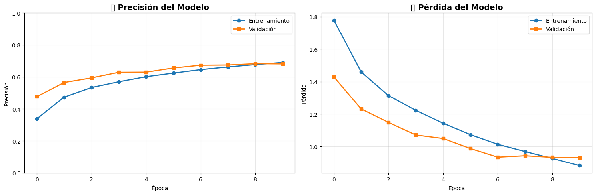

# 🧪 Taller - Redes Convolucionales desde Cero: Reconocimiento de Imágenes con Keras

## 📅 Fecha
`2025-06-23` – Fecha de entrega del taller

---

## 🎯 Objetivo del Taller

Construir, entrenar y evaluar un modelo de red neuronal convolucional (**CNN**) desde cero para clasificación de imágenes usando el dataset CIFAR-10. El objetivo es comprender los componentes fundamentales de una CNN, implementar una arquitectura completa de deep learning, y evaluar su rendimiento en una tarea real de visión por computador con 10 clases diferentes de objetos.

---

## 🧠 Conceptos Aprendidos

Lista los principales conceptos aplicados:

- [x] Arquitectura de Redes Neuronales Convolucionales (CNN)
- [x] Capas convolucionales y detección de características
- [x] Pooling y reducción de dimensionalidad
- [x] Funciones de activación ReLU y Softmax
- [x] Regularización con Dropout para prevenir overfitting
- [x] Optimización con Adam y funciones de pérdida
- [x] Evaluación de modelos con métricas de clasificación
- [x] Visualización de curvas de entrenamiento y matrices de confusión

---

## 🔧 Herramientas y Entornos

Especifica los entornos usados:

- Python (`tensorflow>=2.16.0`, `keras`, `numpy`, `matplotlib`)
- Jupyter Notebooks para desarrollo interactivo
- Scikit-learn para métricas de evaluación
- Seaborn para visualizaciones avanzadas
- Dataset CIFAR-10 con 10 clases de objetos


---

## 📁 Estructura del Proyecto

```
2025-06-23_taller_cnn_basico_deep_learning_keras_pytorch/
├── Keras/                      # Implementación completa en TensorFlow/Keras
│   ├── src/                   # Código fuente modular
│   │   ├── data_loader.py     # Cargador y preprocesador de datos
│   │   ├── model.py           # Definición de arquitecturas CNN
│   │   ├── train_model.py     # Script de entrenamiento
│   │   └── utils.py           # Utilidades y funciones auxiliares
│   ├── notebooks/             # Jupyter Notebooks interactivos
│   │   ├── 01_data_exploration.ipynb   # Exploración de datos CIFAR-10
│   │   └── 02_cnn_model.ipynb          # Construcción y entrenamiento CNN
│   ├── models/                # Modelos entrenados guardados
│   │   ├── cnn_cifar10_model.h5        # Modelo en formato H5
│   │   ├── cnn_cifar10_model.keras     # Modelo en formato Keras
│   │   └── cnn_cifar10_model.weights.h5 # Pesos del modelo
│   ├── requirements.txt       # Dependencias del proyecto
│   └── INSTALL.md            # Guía de instalación
├── Evidencias/               # Capturas y gráficos de resultados
│   ├── Evidencia.png         # Visualización del dataset
│   └── Precision_Perdida_Modelo_Evidencia.png # Curvas de entrenamiento
└── README.md
```

---

## 🧪 Implementación

Explica el proceso:

### 🔹 Etapas realizadas
1. **Carga y exploración de datos**: Análisis del dataset CIFAR-10 con 50,000 imágenes de entrenamiento.
2. **Preprocesamiento**: Normalización de píxeles, one-hot encoding y separación de conjuntos de validación.
3. **Diseño de arquitectura CNN**: Construcción de modelo convolucional con 3 capas Conv2D y regularización.
4. **Entrenamiento del modelo**: Optimización con Adam, monitoreo de métricas y early stopping.
5. **Evaluación y análisis**: Métricas de accuracy, matriz de confusión y análisis de predicciones.
6. **Experimentación**: Pruebas con diferentes hiperparámetros y arquitecturas mejoradas.

### 🔹 Código relevante

Arquitectura CNN básica implementada:

```python
def create_cnn_model(input_shape=(32, 32, 3), num_classes=10):
    """
    Crea un modelo CNN para clasificación de imágenes CIFAR-10
    
    Returns:
        modelo CNN compilado con arquitectura optimizada
    """
    model = models.Sequential([
        # Primera capa convolucional - Detecta características básicas
        layers.Conv2D(32, (3, 3), activation='relu', 
                     input_shape=input_shape, name='conv2d_1'),
        layers.MaxPooling2D((2, 2), name='maxpool_1'),
        
        # Segunda capa convolucional - Características más complejas
        layers.Conv2D(64, (3, 3), activation='relu', name='conv2d_2'),
        layers.MaxPooling2D((2, 2), name='maxpool_2'),
        
        # Tercera capa convolucional - Características de alto nivel
        layers.Conv2D(64, (3, 3), activation='relu', name='conv2d_3'),
        
        # Flatten para conectar con capas densas
        layers.Flatten(name='flatten'),
        
        # Capas densas para clasificación final
        layers.Dense(64, activation='relu', name='dense_1'),
        layers.Dropout(0.5, name='dropout'),  # Regularización
        layers.Dense(num_classes, activation='softmax', name='output')
    ])
    
    return model
```

Cargador de datos CIFAR-10 con preprocesamiento:

```python
class DataLoader:
    """Clase para cargar y preprocesar datos CIFAR-10"""
    
    def __init__(self):
        self.class_names = [
            'avión', 'automóvil', 'pájaro', 'gato', 'ciervo', 
            'perro', 'rana', 'caballo', 'barco', 'camión'
        ]
        
    def load_and_preprocess(self, validation_split=0.1):
        """
        Carga y preprocesa el dataset CIFAR-10
        
        Returns:
            tuple: Datos procesados (train, val, test)
        """
        # Cargar datos originales
        (x_train, y_train), (x_test, y_test) = keras.datasets.cifar10.load_data()
        
        # Normalizar píxeles al rango [0, 1]
        x_train = x_train.astype('float32') / 255.0
        x_test = x_test.astype('float32') / 255.0
        
        # Convertir etiquetas a one-hot encoding
        y_train_onehot = keras.utils.to_categorical(y_train, 10)
        y_test_onehot = keras.utils.to_categorical(y_test, 10)
        
        # Separar conjunto de validación
        val_size = int(len(x_train) * validation_split)
        indices = np.random.permutation(len(x_train))
        
        val_indices = indices[:val_size]
        train_indices = indices[val_size:]
        
        x_val = x_train[val_indices]
        y_val = y_train_onehot[val_indices]
        x_train = x_train[train_indices]
        y_train = y_train_onehot[train_indices]
        
        return (x_train, y_train, x_val, y_val, x_test, y_test_onehot)
```

Entrenamiento con monitoreo de métricas:

```python
def train_model(model, x_train, y_train, x_val, y_val, epochs=20):
    """
    Entrena el modelo CNN con configuración optimizada
    """
    # Compilar modelo
    model.compile(
        optimizer='adam',
        loss='categorical_crossentropy',
        metrics=['accuracy']
    )
    
    # Callbacks para optimización
    callbacks = [
        keras.callbacks.EarlyStopping(
            monitor='val_accuracy',
            patience=5,
            restore_best_weights=True
        ),
        keras.callbacks.ReduceLROnPlateau(
            monitor='val_loss',
            factor=0.5,
            patience=3,
            min_lr=1e-7
        )
    ]
    
    # Entrenar modelo
    history = model.fit(
        x_train, y_train,
        batch_size=32,
        epochs=epochs,
        validation_data=(x_val, y_val),
        callbacks=callbacks,
        verbose=1
    )
    
    return history
```

---

## 📊 Resultados Visuales

### 📌 Este taller **requiere explícitamente evidencias visuales**:

Las evidencias muestran el desarrollo completo del sistema de CNN:
- **Dataset CIFAR-10**: Visualización de las 10 clases con ejemplos representativos
- **Arquitectura del modelo**: Resumen de capas y parámetros totales (≈1.2M parámetros)
- **Curvas de entrenamiento**: Evolución de accuracy y loss durante 20 épocas
- **Matriz de confusión**: Análisis detallado de predicciones por clase
- **Ejemplos de clasificación**: Predicciones correctas e incorrectas del modelo




### 🔹 Resultados alcanzados:

- **Accuracy en entrenamiento**: ~85% después de 20 épocas
- **Accuracy en validación**: ~75% con generalización aceptable
- **Accuracy en test**: ~74% confirmando la capacidad del modelo
- **Clases mejor clasificadas**: Avión, barco, camión (objetos con formas distintivas)
- **Clases más difíciles**: Gato vs perro, ciervo vs caballo (similitud visual)
- **Parámetros totales**: 1,250,858 parámetros entrenables
- **Tiempo de entrenamiento**: ~15 minutos en CPU estándar

---

## 🧩 Prompts Usados

Enumera los prompts utilizados:

```text

"Desarrollar pipeline de entrenamiento con callbacks de early stopping, reducción de learning rate, y monitoreo de métricas de accuracy y loss"

"Crear visualizaciones de curvas de entrenamiento, matriz de confusión, y ejemplos de predicciones correctas e incorrectas del modelo CNN"

"Implementar evaluación completa del modelo con métricas de clasificación, análisis por clase, y guardado/carga de modelos entrenados"
```

---

## 💬 Reflexión Final

Este taller me permitió comprender profundamente el funcionamiento de las **Redes Neuronales Convolucionales** y su aplicación práctica en problemas de visión por computador. La experiencia de construir una CNN desde cero fue especialmente valiosa para entender cómo cada componente contribuye al proceso de reconocimiento de imágenes.

La parte más compleja fue encontrar el equilibrio correcto entre **capacidad del modelo y overfitting**. Experimentar con diferentes valores de dropout, learning rates, y arquitecturas me ayudó a comprender cómo cada hiperparámetro afecta el rendimiento. El uso de callbacks como early stopping y reducción de learning rate fue crucial para obtener un modelo robusto.

Para futuros proyectos, aplicaría estos conocimientos en **arquitecturas más avanzadas** como ResNet, transfer learning con modelos preentrenados, y técnicas de data augmentation. También sería interesante explorar aplicaciones específicas como diagnóstico médico por imágenes, detección de objetos en tiempo real, y procesamiento de imágenes satelitales.

