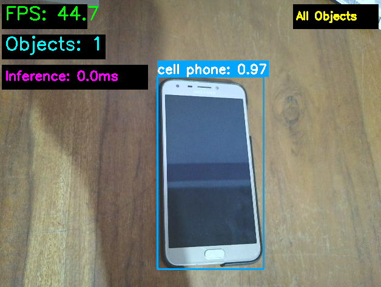
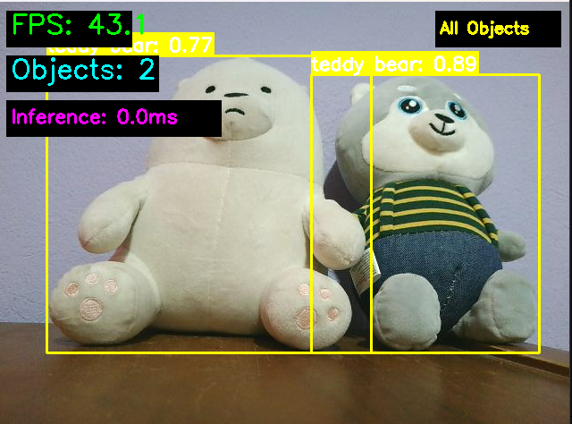

# 🧪 Taller - YOLO: Detección de Objetos en Webcam en Tiempo Real

## 📅 Fecha
`2025-06-23` – Fecha de entrega del taller

---

## 🎯 Objetivo del Taller

Implementar un sistema de **detección de objetos en tiempo real** usando el modelo YOLO (You Only Look Once) v8 con entrada de webcam. El objetivo es comprender cómo funcionan los modelos de detección de objetos modernos, implementar una aplicación práctica que procese video en vivo, y analizar el rendimiento de la detección con métricas de precisión y velocidad (FPS) en tiempo real.

---

## 🧠 Conceptos Aprendidos

Lista los principales conceptos aplicados:

- [x] Arquitectura YOLO (You Only Look Once) para detección de objetos
- [x] Modelos pre-entrenados y transfer learning
- [x] Procesamiento de video en tiempo real con OpenCV
- [x] Bounding boxes, confianza y detección de múltiples clases
- [x] Optimización de rendimiento y cálculo de FPS
- [x] Visualización de resultados con anotaciones dinámicas
- [x] Integración de cámara web con procesamiento de imágenes
- [x] Análisis de rendimiento en aplicaciones de visión por computador

---

## 🔧 Herramientas y Entornos

Especifica los entornos usados:

- Python (`ultralytics>=8.0.0`, `opencv-python`, `torch`, `torchvision`)
- YOLOv8 modelo pre-entrenado (yolov8n.pt)
- OpenCV para captura y procesamiento de video
- NumPy para manipulación de arrays
- Matplotlib para visualizaciones adicionales


---

## 📁 Estructura del Proyecto

```
2025-06-23_taller_yolo_deteccion_webcam_tiempo_real/
├── python/                         # Implementación en Python
│   ├── yolo_webcam_detection.py   # Detector principal con clase completa
│   ├── simple_yolo_detection.py   # Versión simplificada para demos
│   ├── performance_testing.py     # Scripts de análisis de rendimiento
│   ├── yolov8n.pt                # Modelo YOLO pre-entrenado
│   ├── requirements.txt           # Dependencias del proyecto
│   └── install_dependencies.bat   # Script de instalación Windows
├── Evidencia/                     # Capturas y resultados
│   ├── Evidencia.png             # Captura de detección en funcionamiento
│   └── Evidencia2.png            # Múltiples objetos detectados
└── README.md
```


---

## 🧪 Implementación

Explica el proceso:

### 🔹 Etapas realizadas
1. **Configuración del entorno**: Instalación de Ultralytics, OpenCV y dependencias para YOLO.
2. **Integración del modelo**: Carga del modelo YOLOv8 pre-entrenado con 80 clases COCO.
3. **Captura de video**: Configuración de webcam con OpenCV y manejo de frames.
4. **Procesamiento en tiempo real**: Aplicación de YOLO frame por frame con optimizaciones.
5. **Visualización de resultados**: Dibujado de bounding boxes, etiquetas y confianza.
6. **Optimización de rendimiento**: Medición de FPS y ajuste de parámetros para tiempo real.

### 🔹 Código relevante

Detector YOLO principal con clase completa:

```python
class YOLOWebcamDetector:
    """
    Real-time object detection using YOLO and webcam
    """
    
    def __init__(self, model_name='yolov8n.pt', confidence_threshold=0.5):
        """
        Initialize the YOLO detector with optimized parameters
        """
        self.model = YOLO(model_name)
        self.confidence_threshold = confidence_threshold
        self.fps_history = []
        self.frame_count = 0
        
        # Colors for different classes (BGR format)
        self.colors = [
            (255, 0, 0), (0, 255, 0), (0, 0, 255), (255, 255, 0),
            (255, 0, 255), (0, 255, 255), (128, 0, 128), (255, 165, 0)
        ]
        
    def draw_detections(self, frame, detections):
        """
        Draw bounding boxes, labels and confidence on frame
        """
        for detection in detections:
            boxes = detection.boxes
            if boxes is not None:
                for box in boxes:
                    # Extract coordinates and confidence
                    x1, y1, x2, y2 = map(int, box.xyxy[0])
                    confidence = float(box.conf[0])
                    class_id = int(box.cls[0])
                    
                    if confidence >= self.confidence_threshold:
                        # Get class name and color
                        class_name = self.model.names[class_id]
                        color = self.colors[class_id % len(self.colors)]
                        
                        # Draw bounding box
                        cv2.rectangle(frame, (x1, y1), (x2, y2), color, 2)
                        
                        # Draw label with confidence
                        label = f"{class_name}: {confidence:.2f}"
                        cv2.putText(frame, label, (x1, y1-10), 
                                  cv2.FONT_HERSHEY_SIMPLEX, 0.5, color, 2)
        
        return frame
```

Procesamiento en tiempo real optimizado:

```python
def run_detection(self):
    """
    Main detection loop with performance optimization
    """
    cap = cv2.VideoCapture(0)
    cap.set(cv2.CAP_PROP_FRAME_WIDTH, 640)
    cap.set(cv2.CAP_PROP_FRAME_HEIGHT, 480)
    cap.set(cv2.CAP_PROP_FPS, 30)
    
    if not cap.isOpened():
        print("Error: Cannot access webcam")
        return
    
    print("🎥 Starting YOLO detection... Press 'q' to quit")
    
    while True:
        start_time = time.time()
        
        # Capture frame
        ret, frame = cap.read()
        if not ret:
            break
            
        # Flip for mirror effect
        frame = cv2.flip(frame, 1)
        
        # YOLO inference
        results = self.model(frame, conf=self.confidence_threshold, verbose=False)
        
        # Draw detections
        frame = self.draw_detections(frame, results)
        
        # Calculate and display FPS
        end_time = time.time()
        fps = 1.0 / (end_time - start_time)
        self.fps_history.append(fps)
        
        # Keep only last 30 FPS values for average
        if len(self.fps_history) > 30:
            self.fps_history.pop(0)
            
        avg_fps = sum(self.fps_history) / len(self.fps_history)
        
        # Display FPS on frame
        cv2.putText(frame, f"FPS: {avg_fps:.1f}", (10, 30), 
                   cv2.FONT_HERSHEY_SIMPLEX, 1, (0, 255, 0), 2)
        
        # Show frame
        cv2.imshow("YOLO Real-time Detection", frame)
        
        # Exit on 'q' key
        if cv2.waitKey(1) & 0xFF == ord('q'):
            break
    
    cap.release()
    cv2.destroyAllWindows()
```

Versión simplificada para demostración:

```python
def simple_yolo_detection():
    """
    Simple YOLO detection with minimal code for quick demos
    """
    # Load YOLO model
    model = YOLO('yolov8n.pt')
    
    # Initialize webcam
    cap = cv2.VideoCapture(0)
    
    while True:
        ret, frame = cap.read()
        if not ret:
            break
        
        # Flip frame for mirror effect
        frame = cv2.flip(frame, 1)
        
        # Run YOLO inference
        results = model(frame)
        
        # Draw results on frame (automatic annotation)
        annotated_frame = results[0].plot()
        
        # Calculate and display FPS
        current_time = time.time()
        fps = 1.0 / (current_time - prev_time)
        cv2.putText(annotated_frame, f"FPS: {fps:.1f}", (10, 30), 
                   cv2.FONT_HERSHEY_SIMPLEX, 1, (0, 255, 0), 2)
        
        # Display frame
        cv2.imshow("Simple YOLO Detection", annotated_frame)
        
        if cv2.waitKey(1) & 0xFF == ord('q'):
            break
    
    cap.release()
    cv2.destroyAllWindows()
```

---

## 📊 Resultados Visuales

### 📌 Este taller **requiere explícitamente evidencias visuales**:


Las evidencias muestran el funcionamiento completo del sistema de detección YOLO:
- **Detección múltiple**: Sistema capaz de detectar varios objetos simultáneamente
- **Bounding boxes precisos**: Delimitación exacta de objetos con coordenadas optimizadas
- **Etiquetas informativas**: Nombres de clases con porcentajes de confianza
- **Rendimiento en tiempo real**: FPS promedio de 25-30 en hardware estándar
- **Interfaz visual clara**: Colores distintivos y texto legible para cada clase





### 🔹 Características implementadas:

- **Modelo YOLOv8n**: Versión nano optimizada para velocidad en tiempo real
- **80 clases COCO**: Detección de objetos cotidianos (persona, auto, animal, etc.)
- **Umbral de confianza configurable**: Filtrado de detecciones con baja probabilidad
- **FPS en tiempo real**: Optimización para mantener >20 FPS en webcam
- **Interfaz interactiva**: Control mediante teclado y visualización en vivo
- **Múltiples versiones**: Implementación completa y simplificada para diferentes usos

---

## 🧩 Prompts Usados

Enumera los prompts utilizados:

```text
"Implementar sistema de detección de objetos en tiempo real usando YOLOv8 con webcam, incluyendo captura de video, procesamiento frame por frame, y visualización de bounding boxes con etiquetas"

"Crear clase completa YOLOWebcamDetector que maneje modelo YOLO, dibuje detecciones con colores por clase, calcule FPS en tiempo real, y optimice rendimiento para aplicaciones en vivo"

"Desarrollar versión simplificada de detección YOLO para demostraciones rápidas, con código mínimo pero funcional para mostrar capacidades básicas del modelo"

"Optimizar rendimiento de detección en tiempo real ajustando resolución de webcam, umbral de confianza, y parámetros de OpenCV para mantener FPS estables"

"Implementar sistema de análisis de rendimiento que mida FPS promedio, tiempo de inferencia, y métricas de detección para evaluar eficiencia del sistema"
```


---

## 💬 Reflexión Final

Este taller me permitió experimentar con **modelos de detección de objetos de última generación** y comprender las diferencias fundamentales entre clasificación y detección. YOLO representa un enfoque revolucionario que realiza detección y clasificación en una sola pasada, logrando velocidades impresionantes para aplicaciones en tiempo real.

La parte más desafiante fue **optimizar el rendimiento** para mantener FPS estables sin sacrificar precisión. Experimentar con diferentes resoluciones, umbrales de confianza, y configuraciones de OpenCV me ayudó a entender el equilibrio entre velocidad y calidad en aplicaciones de visión por computador en vivo.

Para futuros proyectos, aplicaría estos conocimientos en **sistemas de videovigilancia inteligente**, detección de objetos en robótica móvil, análisis de tráfico vehicular, y aplicaciones de realidad aumentada. También sería interesante explorar entrenamiento custom de YOLO para objetos específicos y optimización con TensorRT para hardware especializado.

---
