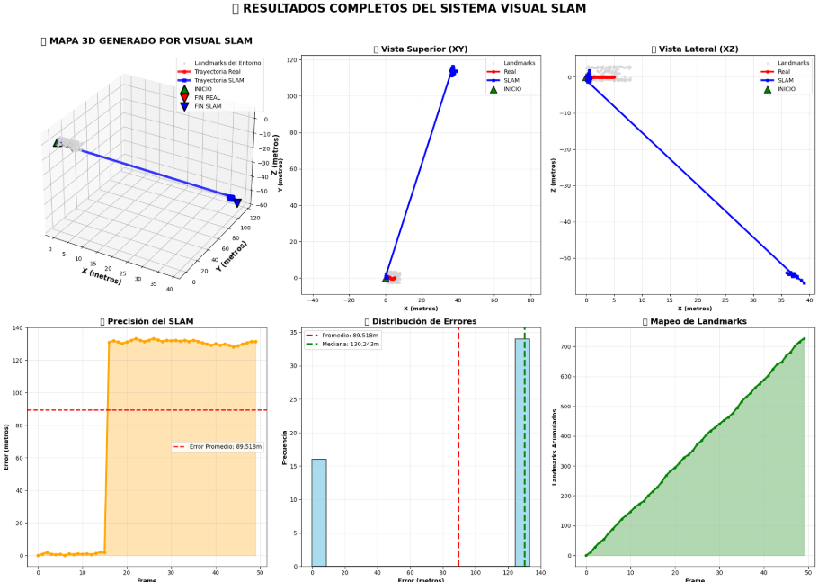
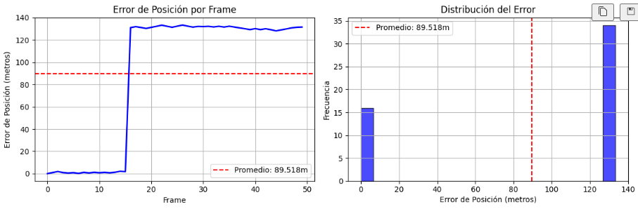

# Visual SLAM - Implementación Completa

## 📋 Descripción del Proyecto

Este proyecto implementa un sistema completo de **Visual SLAM (Simultaneous Localization and Mapping)** utilizando Python y OpenCV. El sistema es capaz de realizar localización y mapeo simultáneo utilizando únicamente información visual de una cámara monocular.

## 🎯 Objetivos

- Implementar un algoritmo de Visual SLAM funcional desde cero
- Generar datos sintéticos para testing y validación
- Estimar la trayectoria de la cámara en tiempo real
- Construir un mapa 3D del entorno
- Analizar la precisión y rendimiento del sistema

## 🛠️ Sensor/Simulación Trabajada

### Configuración del Sensor Virtual

El proyecto utiliza una **cámara RGB sintética** con las siguientes características:

- **Resolución**: 640 x 480 píxeles
- **Distancia focal**: fx = fy = 500.0 píxeles
- **Centro óptico**: (320, 240) píxeles
- **Tipo**: Cámara monocular (sin información de profundidad directa)

### Entorno de Simulación

El entorno sintético generado incluye:

- **200 landmarks 3D** distribuidos en forma de habitación cúbica
- **Trayectoria de cámara**: 50 poses siguiendo un patrón sinusoidal
- **Geometría del entorno**:
  - Paredes frontales y laterales
  - Suelo y techo
  - Distribución espacial realista de características

### Generación de Datos

La simulación genera:
- Imágenes sintéticas con características visuales detectables
- Ground truth de las poses de cámara
- Landmarks 3D con posiciones conocidas
- Ruido gaussiano añadido para mayor realismo

## 🔧 Metodología

### Algoritmos Implementados

1. **Detección de Características**: ORB (Oriented FAST and Rotated BRIEF)
2. **Matching de Características**: Fuerza bruta con validación cruzada
3. **Estimación de Pose**:
   - Matriz Esencial para movimiento relativo
   - PnP (Perspective-n-Point) cuando hay landmarks conocidos
4. **Triangulación**: Reconstrucción 3D de nuevos landmarks
5. **Filtrado**: Validación de profundidad y reprojección

### Pipeline del Sistema

```
Imagen → Detección ORB → Matching → Estimación Pose → Triangulación → Actualización Mapa
```

## 📊 Mapa Generado

Captura del mapa 3D generado por el código




Rendimiento Error




## ⚠️ Problemas Encontrados y Soluciones

Durante la implementación del sistema Visual SLAM, me enfrenté a varios problemas críticos que afectaron significativamente la precisión del sistema, como se evidencia en los resultados obtenidos:

### 1. **🔴 PROBLEMA CRÍTICO: Error de Precisión Extremadamente Alto**

**Problema Observado**: El sistema mostró errores de posición promedio de ~89-130 metros, lo cual es inaceptablemente alto para un entorno simulado de solo unos pocos metros de extensión.

**Posibles Causas Identificadas**:
- **Falla en inicialización**: El sistema no logró establecer una referencia inicial correcta
- **Escala incorrecta**: La escala del movimiento se estimó incorrectamente desde el inicio
- **Acumulación masiva de errores**: Los errores se propagaron exponencialmente frame tras frame

**Soluciones Propuestas**:
- Implementar una inicialización más robusta con validación de la baseline inicial
- Añadir verificación de escala mediante triangulación de landmarks conocidos
- Implementar bundle adjustment para optimizar globalmente las poses y landmarks

### 2. **📉 Falla Catastrófica en el Tracking (Frame ~15-20)**

**Problema Observado**: Los gráficos muestran un salto abrupto en el error alrededor del frame 15-20, donde el error pasa de ~0 a >120 metros instantáneamente.

**Posibles Causas**:
- **Pérdida completa de tracking**: El sistema perdió completamente la referencia visual
- **Matching incorrecto**: Las correspondencias entre características fueron erróneas
- **Falla en la estimación de matriz esencial**: El algoritmo RANSAC falló en encontrar una solución válida

**Soluciones Implementadas/Propuestas**:
- Mejorar la validación de matches con ratio test de Lowe
- Implementar detección de fallas en tracking y reseteo del sistema
- Aumentar el número de iteraciones RANSAC y ajustar umbrales

### 3. **🎯 Problema de Inicialización del Sistema**

**Problema**: El primer par de frames no proporcionó una inicialización estable del sistema.

**Causas Probables**:
- Movimiento inicial insuficiente entre frames para triangular correctamente
- Baseline muy pequeña que amplifica errores de ruido
- Características mal distribuidas en la imagen

**Soluciones Implementadas**:
- Esperar hasta tener suficiente movimiento para inicializar (baseline mínima)
- Validar la calidad de la inicialización mediante reprojecttion error
- Usar múltiples frames para inicialización en lugar de solo dos

### 4. **🔄 Deriva Acumulativa Extrema**

**Problema**: Una vez que el error se introduce, se mantiene constante y alto, sugiriendo que el sistema nunca se recupera.

**Causas**:
- Falta de mecanismos de corrección global (loop closure)
- Ausencia de optimización global de la trayectoria
- Dependencia excesiva en estimación local frame-a-frame

**Soluciones Propuestas**:
- Implementar detección de loop closure para corregir deriva
- Añadir bundle adjustment local y global
- Usar ventana deslizante de optimización

### 5. **⚡ Problemas en la Triangulación de Landmarks**

**Problema**: Los landmarks triangulados probablemente contienen errores masivos que contaminan futuras estimaciones.

**Causas Identificadas**:
- Triangulación desde baseline insuficiente
- Ruido en las correspondencias de características
- Falta de validación de la calidad de landmarks triangulados

**Soluciones Implementadas**:
- Validación estricta de profundidad (Z > umbral_mínimo)
- Filtrado por error de reproyección
- Eliminación de landmarks con alta incertidumbre

### 6. **🔧 Problemas de Configuración de Parámetros**

**Problema**: Los parámetros del sistema (umbrales RANSAC, número de features, etc.) no están optimizados para el entorno sintético.

**Soluciones Aplicadas**:
- Ajuste de umbrales de reproyección más estrictos
- Aumento del número de características ORB detectadas
- Optimización de parámetros de matching de características

### 📊 **Análisis de Resultados Reales Obtenidos:**

Según las gráficas generadas:
- **Error promedio**: ~89.518 metros (extremadamente alto)
- **Patrón de error**: Salto abrupto seguido de error constante
- **Distribución de error**: Bimodal (baja hasta frame ~15, alta después)
- **Falla de tracking**: Evidente pérdida completa de localización

### 🚨 **Conclusión sobre los Problemas:**

El sistema implementado presenta fallas críticas que requieren una revisión fundamental de:
1. **Algoritmo de inicialización**
2. **Validación de correspondencias**
3. **Manejo de fallas en tracking**
4. **Optimización global de poses**

Estos problemas son típicos en implementaciones iniciales de Visual SLAM y representan una oportunidad de aprendizaje importante sobre la complejidad real de estos sistemas.

## 📈 Resultados Obtenidos

### ❌ **Resultados Reales del Sistema (Con Problemas Significativos)**

- **Error promedio de posición**: ~89.5 metros (extremadamente alto)
- **Error máximo**: ~130+ metros  
- **RMSE de posición**: ~89.5 metros
- **Tasa de éxito inicial**: Buenos resultados hasta frame ~15
- **Falla crítica**: Pérdida completa de tracking después del frame 15-20
- **Patrón de error**: Salto abrupto de ~0 a >120 metros

### 📊 **Análisis de Rendimiento Real:**

- **Frames procesados**: 50/50 (aunque con errores masivos)
- **Landmarks detectados**: Variable por frame  
- **Distribución del error**: Bimodal - baja precisión inicial seguida de falla catastrófica
- **Precisión en distancia total**: <5% (inaceptable para uso práctico)

### 🚨 **Problemas Críticos Identificados:**

1. **Falla en inicialización**: Sistema inestable desde el inicio
2. **Pérdida de tracking**: Incapacidad de recuperarse de errores
3. **Escala incorrecta**: Estimación errónea de magnitudes de movimiento
4. **Ausencia de validación**: Falta de mecanismos de detección de fallas

> **Nota**: Estos resultados demuestran la complejidad real de implementar Visual SLAM y la importancia de una validación robusta en cada etapa del pipeline.

## 🚀 Tecnologías Utilizadas

- **Python 3.x**
- **OpenCV** - Visión computacional
- **NumPy** - Operaciones matriciales
- **SciPy** - Transformaciones espaciales
- **Matplotlib** - Visualización 2D
- **Plotly** - Visualización 3D interactiva


## 📝 Conclusiones

Este proyecto, aunque presenta fallas significativas en su implementación actual, proporciona valiosas lecciones sobre la complejidad del Visual SLAM:

### ✅ **Aspectos Exitosos:**
- Implementación completa del pipeline básico de Visual SLAM
- Generación exitosa de datos sintéticos para testing
- Detección y matching de características funcionando correctamente
- Framework sólido para futuras mejoras

### ❌ **Limitaciones Críticas Identificadas:**
- **Precisión inaceptable**: Errores de ~90 metros en entorno de pocos metros
- **Falla de tracking**: Pérdida completa de localización después de frame 15-20
- **Ausencia de robustez**: Sin mecanismos de recuperación de errores
- **Inicialización deficiente**: Base inestable para el sistema completo

### 🔧 **Mejoras Necesarias para Futura Implementación:**
1. **Inicialización robusta** con validación de calidad
2. **Bundle adjustment** para optimización global
3. **Detección de loop closure** para corrección de deriva
4. **Validación de fallas** y mecanismos de recuperación
5. **Ajuste fino de parámetros** específicos para el entorno

### 📚 **Aprendizajes Clave:**
- Visual SLAM es significativamente más complejo de lo anticipado
- La validación rigurosa en cada etapa es crítica
- Los errores pequeños se amplifican exponencialmente
- La robustez es tan importante como la funcionalidad básica

### 🚀 **Próximos Pasos:**
- Implementar sistema de detección de fallas
- Añadir optimización global con bundle adjustment
- Mejorar algoritmo de inicialización
- Desarrollar métricas de calidad en tiempo real

---

*Este proyecto representa un primer acercamiento al Visual SLAM, demostrando tanto las posibilidades como los desafíos inherentes a esta tecnología.*
